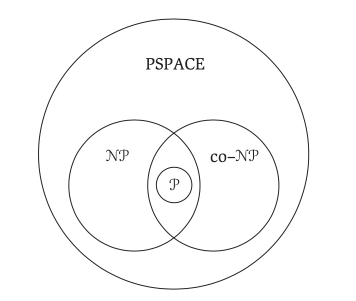
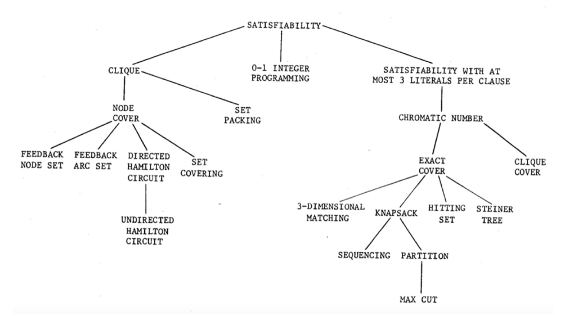

# Complexity Theory

- *Polynomial Time Algorithms*- have a running time of $O(n^k)$ for some constant $k$
- The class $P$ contains problems *solvable* in polynomial time
    - P stands for polynomial time
- The class NP contains decision problems with correct answers ("yes" answers) *verifiable* in polynomial time (given a certificate)
    - NP stands for non-deterministic polynomial time
    - Means the problems can be solved in polynomial time on a non-deterministic machine that can check all possible solutions at once to find the actual solution
        - since they are verifiable in polynomial time 
        - Our current deterministic computers can only check 1 solution at once (make one decision)
- Co-NP is the class of problems with incorrect answers ("no" answers) *verifiable* in polynomial time
- $P \subseteq NP$
    - Open question in theoretical CS (proposed in 1971) is whether $P \neq NP$ (i.e. $P \subset NP$ )?
        - Question: Do all problems verifiable in polynomial time, also have an algorithm that solves them in polynomial time? 
        - Most theorize $P \neq NP$ or else lots of hard, important problems would already be solved
- *Tractable/Easy*- problems that are solvable by polynomial time algorithms
- *Intractable/Hard*- problems that require superpolynomial time to solve
- The class NPC contains problems the hardest problems in NP
- Exp- classes of problems outside of NP that take exponential time to even verify a solution for (e.g. checking if a move in chess made was even the right move)
- [Cook-Levin Theorem (1971)](https://en.wikipedia.org/wiki/Cook–Levin_theorem)
    - Every problem in NP can be reduced to the SAT problem in polynomial time
    - If SAT can be solved in polynomial time, so can every other problem in NP
    - If anyone ever proves a problem in NP to be intractable, then SAT must also be intractable

- [The Computational Complexity Zoo](https://www.youtube.com/watch?v=YX40hbAHx3s)
- [P vs. NP](https://www.youtube.com/watch?v=u2DLlNQiPB4)
- 
- Note the above relationships are conjectures and have not been formally proven yet 
- PSPACE- set of all problems solvable by an algorithm w/ polynomial space complexity
    - $P \subseteq \text{PSPACE}$ (in polynomial time, an algorithm can use only a polynomial amount of space)
    - $\text{NP} \subseteq \text{PSPACE}$ since the 3-SAT problem is solvable w/ an algorithm using a polynomial amount of space
    - Many problems in AI and game theory are in the domain of PSPACE

## Decision Problems

- Oftentimes its easier to work with a decision problem equivalent of an optimization problem
- Optimization Problem: Find the smallest number of colors needed to color $G$ and produce that coloring
- Decision Problem: Given $G$ and $k$, is there a coloring of $G$ using at most $k$ colors? 
- Original optimization problem can be solved using the decision problem
    - Ex: Loop through $k = 1,\dots, V$, for the decision problem. If the decision problem is solvable in polynomial time then there exists a polynomial time to solve the optimization problem 
- *Certificate*- a canidate answer for a decision problem 
- When the optimization is to find the largest, the corresponding decision problem for existance asks "... $k$ or more"
- When the optimization is to find the smallest, the corresponding decision problem for existance asks "... at most $k$"

## NP-Complete

- Describes a class of problems who status is unknown 
    - no polynomial-time algorithm has been discovered yet
    - no one has been able to prove no polynomial time algorithm can exist for any one of them 
- Prove your problem is just as hard as a large number of other problems for which no efficienct algorithm has been found 
- If a solution could be found for these other problems, then it could be found for yours also

### Solving NP-Complete Problems

- Won't be able to find an algorithm that produces an exact solution
- Can find an algorithm that works for a subset of inputs
- Can find an algorithm with a good average case time complexity
- Can find an algorithm that produces an approximate answer that is close to best

### Prove a problem is NP-Complete

- Let problem $A$ be the problem we want to show is NP-complete
- Let $B$ be a well-known NP-complete problem
- To show $A$ is np-complete:
    1. Show $A  \in \text{NP}$
        - prove a yes answer from a certificate can be verified in polynomial time
    2. Show that $B$ can be reduced to $A$ in polynomial time 
        - Technically we need to reduce all NP-complete problems to $A$, however, Cook-Levin's Theorem on SAT already did this so we just need to do it for one known NPC problem

- Remember that $A$ and $B$ are decision problems
- [Video](https://www.youtube.com/watch?v=a_IRpiyBIm0)

## Reduction

- We want to reduce a problem $C$ into problem $D$ in polynomial time
- Create a function $R$ that transforms inputs for $A$ to inputs for $B$ s.t. $A(x)$ is yes iff $B(R(x))$ is yes
- 
- Tree of reducability for combinatorial problems

### Vertex Cover

- Given a graph $G(V,E)$, a vertex cover is a set of vertices $V'$ such that for each edge $uv \in E$, $u$ or $v$ is in $V'$
- Optimization Problem: What is the size of the smallest vertex cover?
- Decision Problem: Is there a vertex cover of size $k$ or fewer vertices?

### Hamiltonian Path

- Given a graph $G(V,E)$, a hamiltonian path is a set of edges (a path) that visits each vertex exactly once
    - A hamilton cicuit is a hamilton path that begins and ends at the same vertex
- Decision Problem: Is there a hamiltonian path in $G$?