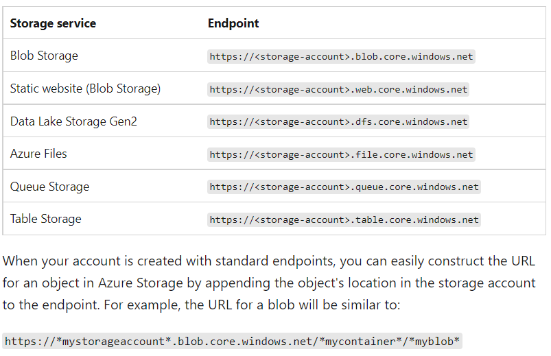
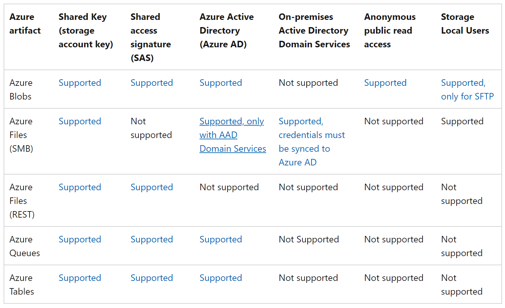

# Storage Overview

- Can access data objects over HTTP/HTTPS via Rest API
  - Client libraries exist in Java, Python, etc. for building apps/services

## Data Services

- Blobs- object store for text/binary data

- Files- file shares 

- Queues- messaging store

- Tables- NoSQL store for schema-less storage of structured data

- - Shares same table data model & CRUD operations as Cosmos DB Table API
  - Not same as Cosmos DB [Microsoft Azure Cosmos DB vs. Microsoft Azure Table Storage Comparison](https://db-engines.com/en/system/Microsoft+Azure+Cosmos+DB%3BMicrosoft+Azure+Table+Storage)

- Disks- block level storage volumes for VMs

## Types of Storage Accounts

- Standard- recommended for most scenarios

- - Blob storage, Queue, Table Storage, Files

- Premium Block Blobs-  recommended for high transaction rates, smaller objects, or low storage latency requirements

- - Blob storage

- Premium File Shares

- - Files

- Premium Page Blobs

- - Page blobs only in blob storage

## Endpoints

- Every object in Azure storage has a URL that includes the unique storage account name

## Authorization

- Shared Key- header in each request signed w/ storage account access key

- - Recommendation to disallow for security

- Share Access Signatures (SAS)- signed url specifying permissions granted to the resource and the interval the signature is valid over

- - Service/Account SAS- signed w/ account key
  - User delegation SAS- signed w/ Azure AD credentials; applies to blobs only

- Azure Active Directory (AAD)-     

- - Recommended method of auth for optimal security and ease of use 
  - Azure role-based access control (Azure RBAC) can be used for managing permissions to a resource in a storage account

- [Authorize operations for data access - Azure Storage | Microsoft Docs](https://docs.microsoft.com/en-us/azure/storage/common/authorize-data-access)