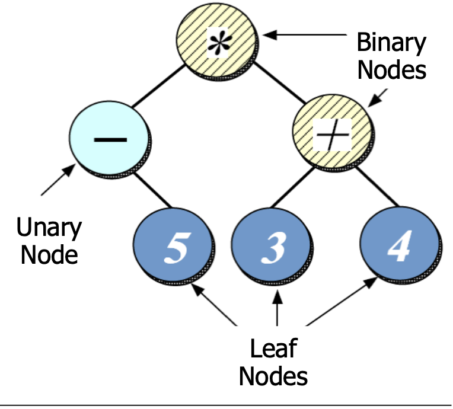

# Binary Tree

explain like im five 

picture or visualization

## Purpose

why does it exist?

why would you ever choose this over other data structures?

what is the data structure optimized for? insertions/deletion? resizing? etc?

### Advantages

### Disadvantages

## Implementations
**Array**:
- Can be efficiently stored as an array due to each node having a max of two children
- left child: $(index * 2) + 1$
- right child: $(index * 2) + 2$
- parent: $(index - 1) / 2$  (not used on the root!)

**Nodes**:
- Can be stored as nodes with left and right child pointers 

## Big O Analysis
**Array Implementation**
| Operation | Big O | Explanation |
|-----------|-------|-------------|
| insertion | O(log N) | traverse logN levels to perform insertion |

**Node Implementation**
| Operation | Big O | Explanation |
|-----------|-------|-------------|
| insertion | O(log N) | traverse logN levels to perform insertion |

## Code 

## Binary Trees
- Each parent has maximum of two children (left and right child)
    - Predetermined max number of children lets us store binary trees as arrays of size at least $2^{depth - 1}$
    - Tree with 3 full levels has $2^3 -1$ nodes
- Array representation allows use of formulas to access specific nodes:

- **Binary Search Trees:** special case of a binary tree where the left child values are less than the parent and the right child values are greater than the parent
- 

## traversal

- in-order: left, cur, right
  - -, 5, *, 3, +, 4
- pre-order: cur, left, right
  - *, -, 5, +, 3, 4
- post-order: left, right, cur
  - 5,-,3,4,+,*
  - easier for computers to compute in
- level-order: across each level from left to right
  - *, -, +, 5, 3, 4
  - discards lots of info encoded in the tree so not as useful as the others