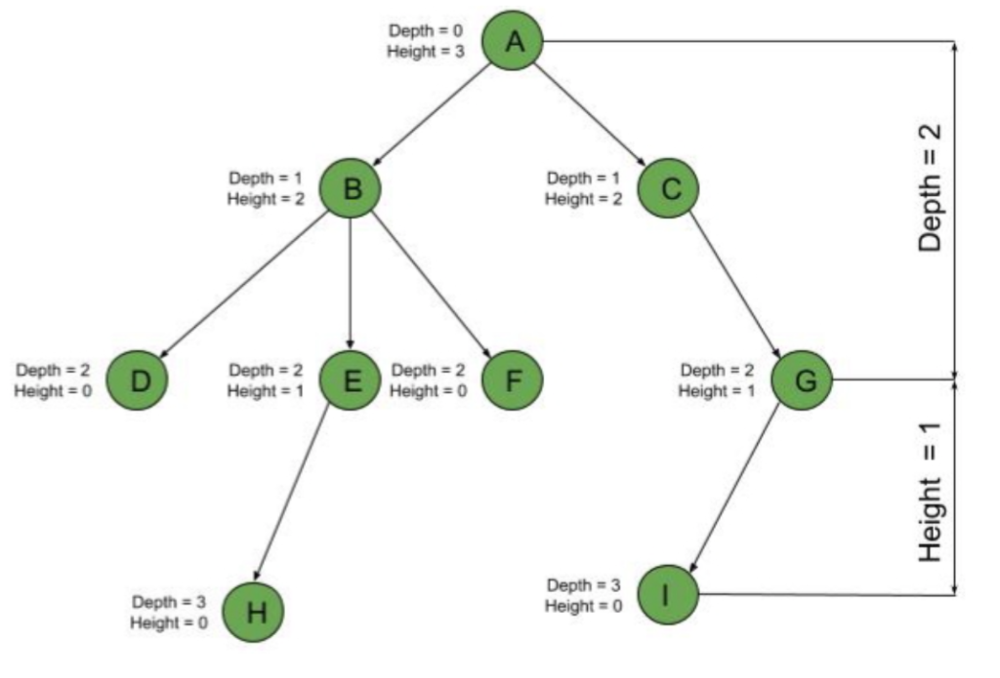

# Overview of Data Structures
Its important to note that many of these data structures are implemented using other data structures. For instance, a stack may be implemented with a linked list. 

Oftentimes more complex data structures are built off of arrays, using more specialized behaviors and rules to increase performance in some aspect (e.g. binary trees can be implented with arrays and using math to calculate node indices).

## Linear/Sequential
- Array
- Linked List
    - Singly/Doubly Linked
    - Circular
- Stack (LIFO)
- Queue (FIFO)

## Tree
- Binary Tree
    - Binary Heap
    - Binary Search Tree
        - Self Balancing: AVL, Red-Black
- B Trees
    - 2-3 Trees
- Trie

## Associative
- Hash-table/Map 
- Set 