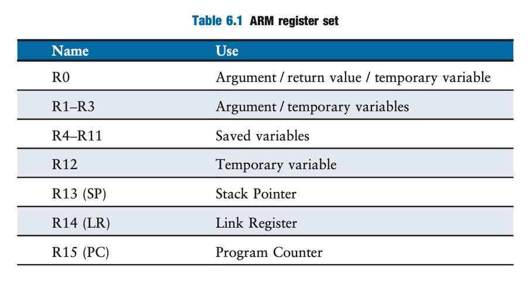
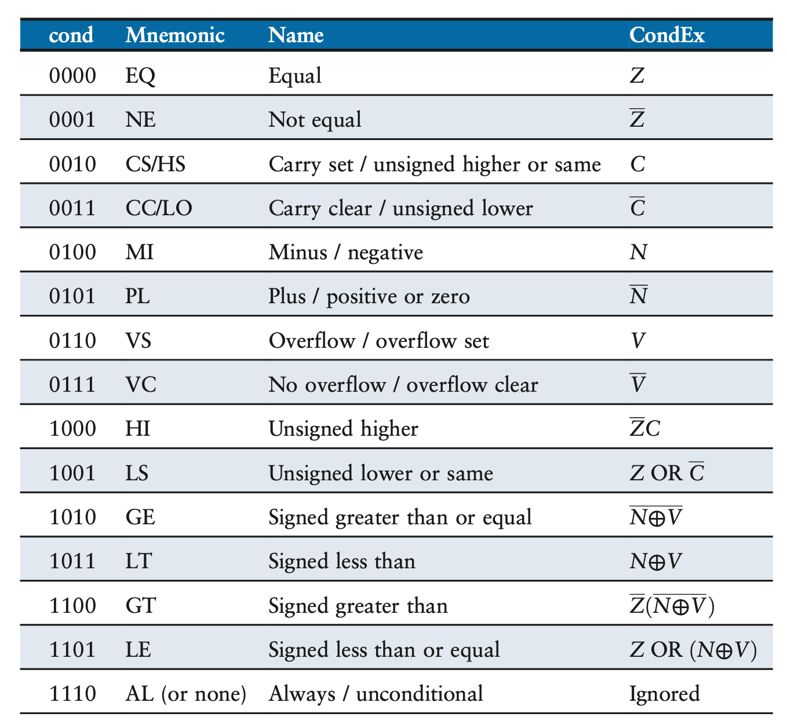
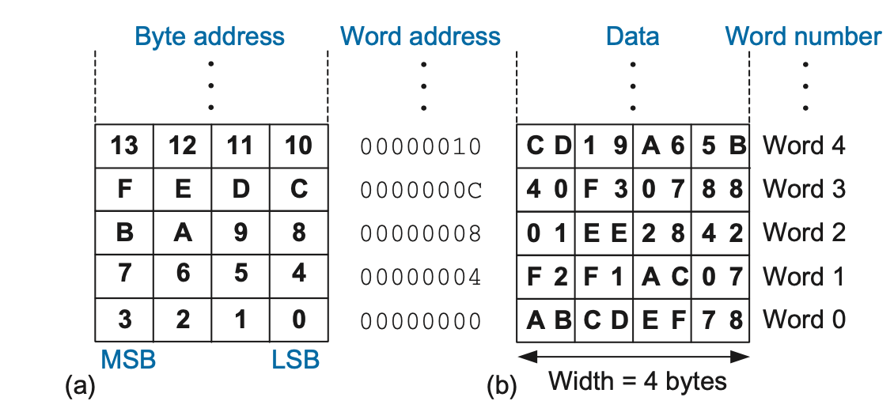
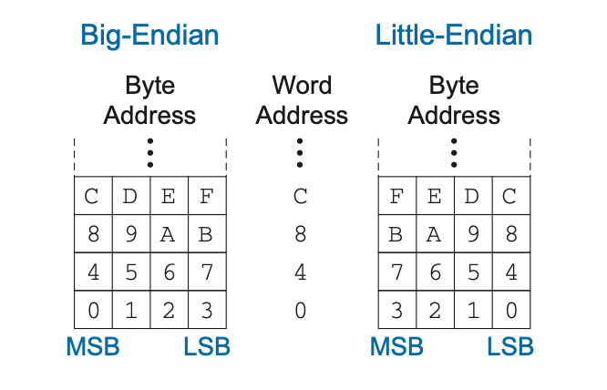
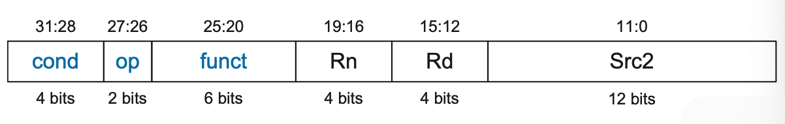

# Architecture

## Assembly Language

`MOV R1, R7` copies the contents of register 7 into register 1

### Memory
- ARM uses byte-addressable memory meaning each byte in memory has a unique address
    - 32-bit word has 4 bytes, so each word address is a multiple of 4 

- Big Endian- bytes are numbered starting with 0 at the most significant end
- Little Endian- bytes are numbered starting with 0 at the least significant end
  

- `LDR destination register, [base register, offset]` loads the data from the base register + offset into the destination register
- `STR destination, [base register, offset]` writes a data word from the base register + offset address to the destination register

## Machine Language
ARM uses 32-bit instructions that can be either data-processing, memory, or branch.

### Data-Processing
- Has 2 source operands
    - 1st source operand which is a register
    - 2nd source operand which is register or (optionally shifted)register

- *cond*- conditional execution
- *op*- operate code
- *funct*- 
- *rn*- first source register
- *rd*- destination register
- *src2*- second source (3 variations)
    - 1) Immediate 
    - 2) Register (rm) optionally shifted by a constant (shamt5)
    - 3) Register (rm) shifted by another register (rs)
    - For 2) and 3), `sh` encodes the type of shift to perform

### Branch
- The immediate’s value is relative to 2 instructions in front of the branch instruction (PC + 8)
    - Encoded in two’s complement so there can be negative values for branches in loops
