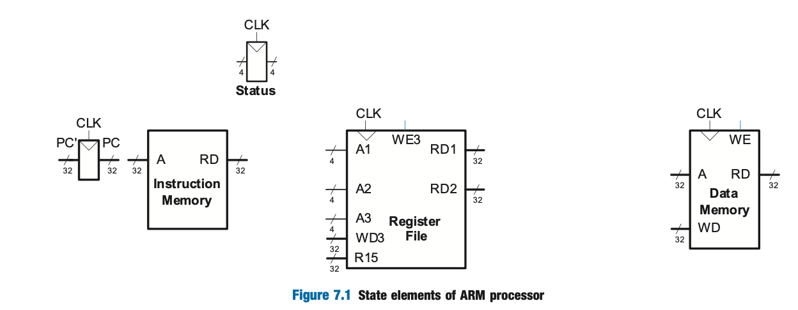
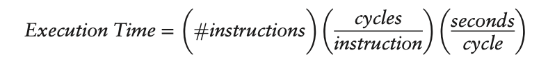
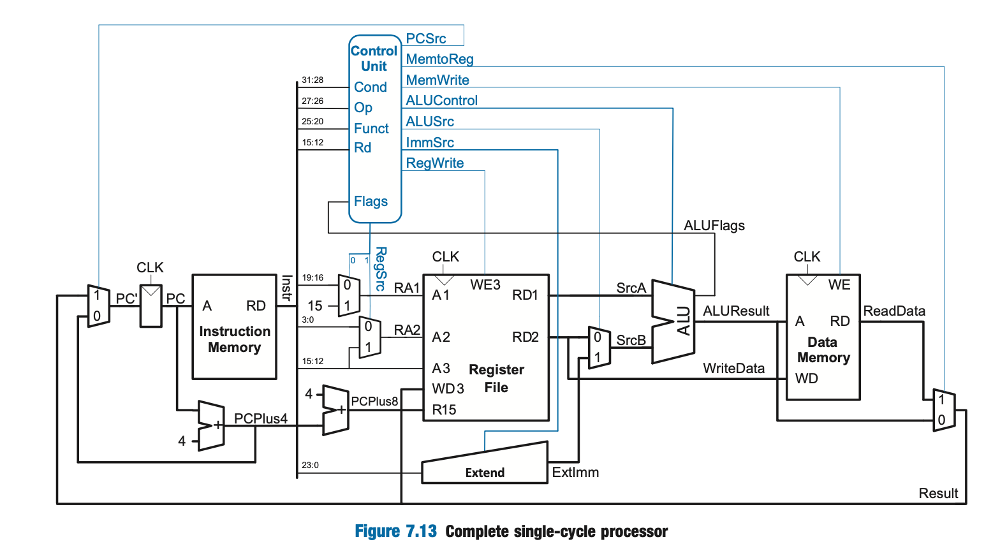

# Microarchitecture

- **Microarchitecture**- the connection between logic and architecture
    - specific arrangement of registers, ALUs, FSMs, memories, etc. 
- A particular architecture like ARM can have many different microarchitectures, each with their own trade-offs on performance, cost, and complexity 

## Architectural State and Instruction Set

- A computer architecture is defined by its instruction set and architectural state (e.g. 16, 32-bit registers and status register for ARM processor)
- Based on current architectural state ,the processor executes an instruction with a set of data to produce a new state

We will consider only the following instructions for simplicity:

- Data Processing: `ADD`, `SUB`, `AND`, `ORR` (no shifts)
- Memory: `LDR` and `STR` 
- Branching: `B`

## Design Process

- Split microarchitectuers into two interacting parts:
    - 1) Datapath- operates on words of data and contains structures like memories, registers, ALUs, and muxes
        - 32-bit arch --> 32-bit datapath
    - 2) Control Unit- receives current instruction from the datapath and tells the datapath how to execute the instruction
- Signals Produced by control unit:
    - mux select
    - register enable
    - memory write

- start with hardware containing state elements and add in combinational logic btw the state elements to compute new state based on current state 
- memory is usually split into 2 for instructionsa and data

## State Elements

- Status Register: contains the 4 flags from the ALU
- Program Counter:
    - `PC'` input is the address of the next instruction
    - `PC` output is address of the current instructon
- Instruction Memory:
    - `A` input is the address of the 32-bit instruction
    - `RD` output is the 32-bit data (instruction) at the input address
- Register File: holds registers R0-R14 
    - Read Ports:
        - `A1` and `A2` inputs are the 4-bit addresses of one of the 16 registers (each specifies a source operand)
        - `RD1` and `RD2` outputs are the 32-bit register values for the input registers
    - Write Port:
        - `A3` input is a 4-bit register address
        - `WD3` input is 32-bit data to be written
        - `WE3` input specifies whether to write (write enable)
        - If write is asserted, the data is written to the register specified by `A3` on the rising edge of the clock
    - `R15` is for managing the relationship with the PC
        - read from here should always be PC + 8
- Data Memory:
    - `WD` input is the 32-bit data to write to memory
    - `WE` input is whether write is enabled (writes on rising edge of the clock)
    - `A` input is the 32-bit address to read from (if `WE = 0` ) or write to (if `WE = 1`)
    - `RD` output is the 32-bit data read from the specified memory address
        - only has a value if `WE = 0`

- Instruction memory, register file, and data memory are *read* combinationally (i.e. no clock is involved)
- The clock is used in the register file and data memory for controlling writes to only occur on the rising edge (i.e. state only changes on rising edge of clock)
- This makes the microprocessor a synchronous sequential circuit (i.e. microprocessor is a giant FSM or collection of many smaller FSMs)

## Microarchitectures

- Single-cycled, multicycleed, and pipelined differ in how the state elements are connected together and in the amount of nonarchitectural state
- **Single-Cycled**- executes an entire instruction in one cycle
    - cycle time limited by slowest instruction
    - no nonarchitectural state required
- **Multicycle**- executes instructions in a series of shorter cycles
    - Simpler instructions execute in fewer cycles than more complex one
    - Several nonarchitectural state registers to hold intermediate results
    - Cheaper b/c it reuses expensive harware like adders and memories
    - Executes on instruction at a time, but it takes multiple clock cycles
- **Pipelined**- executes several instructions simulataneously
    - Requires extra logic for handling dependencies between simultaneously executing instructions
    - Requires nonarchitecutral state registers
    - Use seperate instruction and data caches since they must access instructions and data in the same cycle
    - Used by all commercial high-performance processors

## Performance Analysis

- Clock frequency and number of cores are unreliable methods of analyzing a processor since certain processors can do more work in a cycle than others
- Execution time on benchmark programs is a more reliable way of measuring performance
  

- The number of instructions in a program can vary depending on the microarchitecture and the cleverness of the programmer
- Cycles per instruction (CPI)- # clock cycles required to execute an average instruction
    - Affected by memory system when its not ideal and there are misses

## Single-Cycle Processor

- Next instruction is 32 bits or 4 bytes so we need to add 4 to the current instruction PC to get the next instruction `PC'` 
- The extend block extends the 12 bits from the src2 component to get a properly extended 32 bit result which is send to the ALU with the output from the register file's read output port 
    - Result of ALU is the memory address we want to read from (the data at outputby the data memory is then passed to the write port in the register file )

Example:

- `LDR R1, [R2, #5]` requires:
    - read value from R2 (should be an address)
    - add offset to it
    - read whats at the resulting address
    - write the data into R1 

### Controller
- Combinational logic responsible for calculating the control signals based on the current instruction and current state of the system
- Inputs:
  - Different parts of the instruction
  - The ALU status flags
- Outputs:
  - 8 control signals that control the flow of data in the datapath

#### Control Signals
- `PCSrc` decides where to get next instruction from
    - `1`: ReadData (result of a write to R15 or a branch instruction)
    - `0`: PC + 4 (next instruction)
- `RegSrc`: two bits which controls two muxes that select where the register addresss of the register file should come from
    - MSB decides whether the 1st register address should come from instruction bits or from the value 15 to support operations with R15
    - LSB decides which part of the instruction bits the 2nd register address should come from
- `RegWrite` specifies whether we are writing into a register
- `ImmSrc` is two bits that control what kind of immediate extension needed
  - unsigned 8 bit, unsigned 12 bit or signed 24 bit immediate to 32-bit immediate
- `ALUSrc` selects where the 2nd ALU argumnet should come from
    - either a register or the result of an immediate extension
- `ALUControl` selects which operation the ALU should perform
- `MemWrite` specifies whether or not we are writing our data into memory
- `MemToReg` selects what results should be passed along
    - either something read from memory or the ALU's result