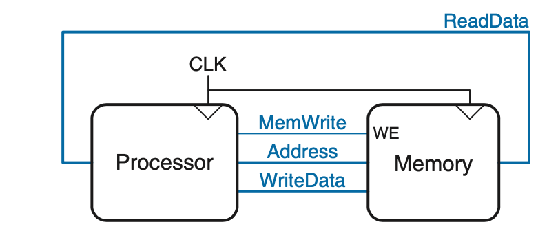
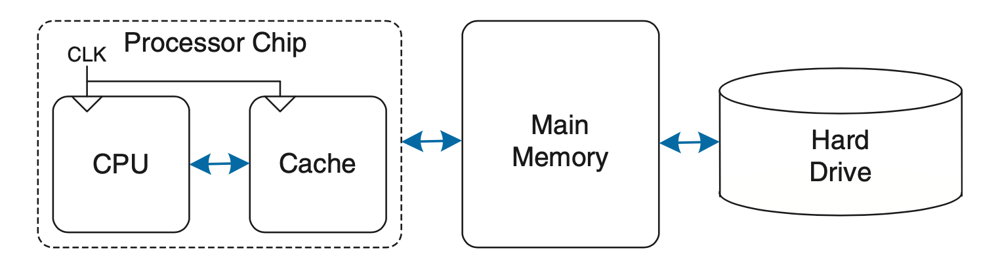
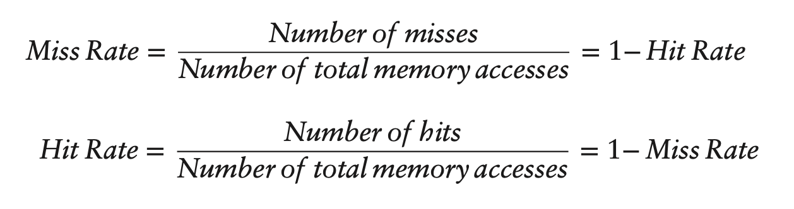
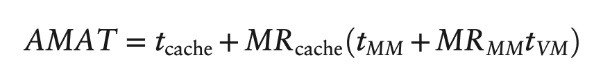

# Memory Systems
- Computer performance depends on both the processor and the memory system
- Memory is slower than processors so designs try to approximate a memory as fast as a processor
  
Simple memory interface used in previous chapters:

- Send memory address over the Address bus
- To read from memory: send `MemWrite = 0` and then `ReadData` will contain the data at the specified address
- To write to memory: send `MemWrite = 1` and send data to be written over the `WriteData` bus

## Tradeoffs
In practice, a memory system has only 2 of the 3:

1. Fast
2. Large 
3. Cheap

Can approximate an ideal fast, large, and cheap memory system by combining a fast small cheap memory and a slow large cheap memory.

- The fast memory stores most commmonly used data and instructions
- The large memory stores the remainder of the data and instructions 

Principles of Locality:

- Used to determine what data to store in the fast memory
- **Temporal Locality:** a referenced memory location will tend to be referenced again soon
- **Spatial Locality:** a referenced memory location will tend have its nearby addresses also referenced soon

## Memory Hierarchy
1. Registers 
    - Fastest memory access 
2. Cache
    - L1 is smaller and faster than secondary cache L2
    - L2 is larger
3. Main Memory (DRAM)
    - Order of GB
4. Disk memory 
    - External hardrives on order of TB, PB, etc. (essentially infinite)
    - Very slow access (e.g 1s) 

Want to put most useful memory as close to processor as possible to reduce access time

## Performance Analysis

- **Miss Rate**- how often the processor requests data from a memory system and it does not find it
- **Hit Rate**- how often the processor requests data from a memory system and it returns
- **Average Memory Access Time (AMAT)**- average time a processor must wait for memory per load or store instruction
    - cache --> main memory --> virutal memory on hard disk

AMAT = cache access time + cache miss rate(main memory access time + main memory miss rate * virtual memory access time)

Amdahl's Law- effort spent increasing the performance of a subsystem is only worth it if the subsystem affects a large percentage of the overall performance

## Caches
- Goal is to anticipate all the data needed by processor and fetch it ahead of time so the cache has a 0% miss rate.
- Caches are located on the same chip as the processor or very close to it.
- Cache uses temporal and spatial locality to achieve a low miss rate.
- Cache block/cache line is the group of adjacent  words fetched by the cache when it fetches on word from memory.
    - block size- # words in the cache block ($b$)
    - capacity ($C$) contains $B = C / b$ blocks 
- Caches are organized into $S$ sets each of which hold 1+ block of data 