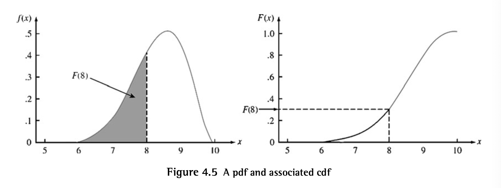

# Continuous Random Variables 
A CRV $X$ satisifes:
1) Possible values of $X$ make up an interval or union of disjoint intervals
2) $P(X = c) = 0)$ for any$c$ that is a possible value of $X$

## Probability Density Function
DEF: Let $X$ be a CRV. Then a probability density function of $X$ is a function $f$ s.t.

$$P(a \leq X \leq b) = \int_a^b f(x) dx$$

This can be interpreted as the probability that $X$ takes on a value in the interval $[a,b]$ is the area above the interval and under the graph of the density function.

Properties of pdfs:
1) $f(x) \geq 0$ for all $x$
2) $\int_{-\infty}^\infty f(x)dx = 1$ (area under the entire graph of $f(x)$)

## Cumulative Distribution Function

$$F(x) = P(X \leq x) = \int_{-\infty}^x f(y) dy$$

This can be interpreted as the area under the density curve to the left of $x$.
  

## Propositions

$$P(x > a) = 1 - F(a)$$

$$P(a \leq X \leq b) = F(b) - F(a)$$

The $(100p)$th percentile of a CRV $X$:

$$p = F[n(p)] = \int_{-\infty}^{n(p)} f(y) dy$$

where $n(p)$ is the value on the measurement axis s.t. $100p$% of the area under the density curve is to left of $n(p)$

Ex: $n(.75)$ stands for the 75% percentile where 75% of the area is to the left of $n(.75)$

## PDFs and CDFs
PDFs measure how much the mass changes per unit of length (aka contribution to mass per unit length)

CDFs measure the total mass up to a pt x (achieves this my taking the integral on the desired interval to get the mass of that interval)

$$F(x) = \int_{-\infty}^x f(y) dy$$

In the cdf's formula, the $dy$ is a tiny length so $f(y)dy$ is the contribution of mass by the point $y$ so integrating (summing over an uncountable interval) the interval gives the total mass of probability.

To get the cdf from the pdf, we integrate the pdf over the desired interval.

To get the pdf from the cdf, we take the derivative of the cdf and evaluate it at the desired point.

At every $x$ which $F'(x)$ exists, $F'(x) = f(x)$

## Variance
$$\sigma_X^2 = V(X)= \int_{-\infty}^\infty (x - \mu)^2 f(x) dx = E[(X - \mu)^2]$$ 

$$V(X) = E(X^2) - [E(X)]^2$$

$$V(aX + b) = a^2\sigma_X^2$$

## Expected Value
$$E(aX + b) = aE(X) + b$$

If $X$ is largely concentrated on an interval of values close to $\mu$, the mean value and variance of $Y = h(X)$ can be approximated using the assumption that $h(x)$ is differentiable.

## Approximating
$$E[h(X)] \approx h(\mu)$$

$$V[h(X)] \approx [h'(\mu)]^2 \sigma^2$$

These follow from approximating $h(X)$ using a first order taylor series expansion about $(\mu,h(\mu))$:

$$Y = h(X) \approx h(\mu) + h'(\mu)(X - \mu)$$

## Moment Generating Functions
$$M_X(t) = E(e^{tX}) = \int_{-\infty}^{\infty} e^{tx}f(x)dx$$

Properties:

$$M_X(0) = E(e^0) = \int_{-\infty}^{\infty} e^{0x}(fx)dx = \int_{-\infty}^{\infty} f(x)dx = 1$$

Let $Y = aX +b$. Then $M_Y(t) = e^{bt}M_X(at)$.