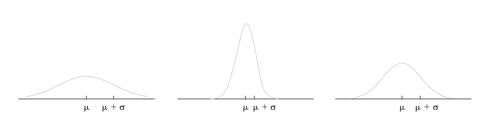
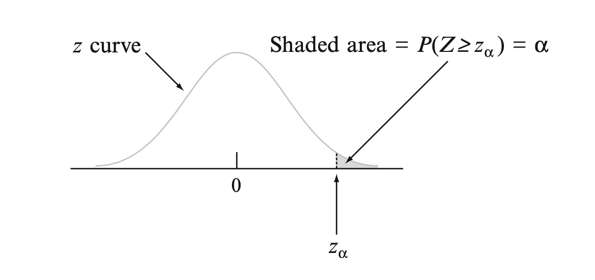
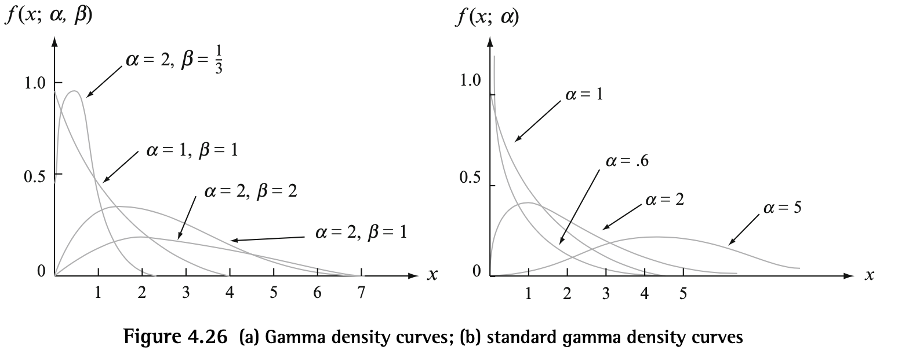

# Discrete Random Variables
---
## Binomial Distribution
---
## Negative Binomial Distribution
---
## Hypergeometric Distribution
---
## Geometric Distribution
---
## Poisson Distribution

# Continuous Random Variables

---
## Uniform Distribution

---
## Exponential Distribution

---
## Normal Distribution
DEF: A CRV $X$ has a normal/gaussian distribution with parameters $\mu$ and $\sigma$ (or $\sigma^2$) where $-\infty < \mu < \infty$ and $0 < \sigma$ if the pdf is:

$$f(x; \mu, \sigma) = \frac{1}{\sqrt{2\pi}\sigma}e^{-\frac{(x-\mu)^2}{2\sigma^2}}$$

$X \sim N(\mu,\sigma^2)$

A large $\sigma$ implies a value far from $\mu$ is well observed whereas such a value is unlikely when $\sigma$ is small.

### Standard Normal Distribution
Since standard integration techniques cannot be used to evaluate the cdf of a normal distribution, the standard normal distribution ($\mu = 0$ and $\sigma = 1$) has been tabulated and can be used to compute probabilities for any other values of $\mu$ and $\sigma$.

The PDF:

$$f(z;0,1) = \frac{1}{\sqrt{2 \pi}}e^{-\frac{z^2}{2}}$$

The CDF:

$$\Phi(z) = P(Z \leq z) = \int_{-\infty}^z f(y;0,1)dy$$

### Non Standard Normal Distributions
To compute probabilities for $X \sim N(\mu,\sigma^2)$ we create a standardized random variable:

$$Z = \frac{X - \mu}{\sigma}$$

Thus,

$$P(a\leq X \leq b) = P(\frac{a-\mu}{\sigma} \leq Z \leq \frac{b - \mu}{\sigma}) = \Phi(\frac{b-\mu}{\sigma}) - \Phi(\frac{a - \mu}{\sigma})$$

$$P(X \leq a) = \Phi(\frac{a - \mu}{\sigma})$$

This results in expected values, variances, and mgfs of the following form:

$$E(X) = E(\sigma Z + \mu) = \sigma E(Z) + \mu = \sigma(0) + \mu = \mu$$

$$V(X) = V(\sigma Z + \mu) = \sigma^2V(Z) = \sigma^2(1)
 = \sigma^2$$
$$M_X(t) = e^{\frac{\mu t + \sigma^2 t^2}{2}}$$

### Normal Approximation of Binomial Distribution
Normal distributions can approximate binomial distributions quite well as long as they are not too skewed meaning their probabaility of success $p$ is roughly around $0.5$.

$X \sim N(np, \sqrt{np(1-p)})$

$$P(X \leq x) = \Phi(\frac{x + 0.5 - np}{\sqrt{np(1-p)}})$$ 

0.5 is the continuity correction that basically corrects for the discreteness of the underyling binomial distribution.

The approximation is adequate provided that $np \geq 10$ and $n(1-p) \geq 10$. Otherwise, the binomial distribution may be too skewed for the symmetric normal curve to give accurate approximations.

### Z Critical Values
In statistical inference, we need values on the measurement axis that capture small tail areas under the standard normal curve.

$z_\alpha$ denotes the value on the measurement axis for which $\alpha$ of the area under the z curve lies to the right of $z_\alpha$. Also is the $100(1-\alpha)$th percentile of the standard normal distribution.

---
## Gamma Distribution
The gamma family of pdfs yield a wide variety of skewed distributional shapes that can be used for situations in which the symmetric normal disitrubtion does not accurately represent the skewed random variable.

In order to define the family of gama distributions we first must define an important function in many areas of mathematics.

DEF: For $\alpha > 0$, the gamma function $\Gamma(\alpha)$ is defined by:

$$\Gamma(\alpha) = \int_0^\infty x^{\alpha - 1}e^{-x}dx$$

With the gamma function, we can then define the gamma distribution for a CRV $X$:

$$f(x; \alpha, \beta) =  \begin{array}{cc}
  \Bigg \{ & 
    \begin{array}{cc}
      \frac{1}{\beta^\alpha \Gamma(\alpha)}x^{\alpha - 1}e^{-x/\beta} &  x > 0 \\
      0 & otherwise
    \end{array}
\end{array}$$

where $\alpha > 0$ and $\beta > 0$.

The **Standard Gamma Distribution** has $\beta = 1$. 

$\beta$ is known as the *scale parameter* because values less than one compress the pdf in the x direction, and values greater than one stretch the pdf in the x direction

$\alpha$ determines how far to the right the distribution's center is, with larger values making it centered more to the right.

$$E(X) = \alpha \beta$$
$$V(X) = \alpha \beta^2$$

$$M_X(t) = \frac{1}{(1- \beta t)^\alpha} $$

### Incomplete Gamma Function
The cdf when $X$ is a standard gamma rv (for $x >0$), 
  
$$F(x; \alpha) = \int_0^x \frac{y^{\alpha - 1}e^{-y}}{\Gamma(\alpha)}dy  $$ 

The incomplete gamma can be used to compute any non standard gamma distibution's probabilities since it has been tabulated.

For $X \sim G(\alpha,\beta)$,  the cdf of $X$ is the incomplete gamma function evaluated at $x/\beta$:

$$F_X(x; \alpha,\beta) = F(\frac{x}{\beta};\alpha)$$