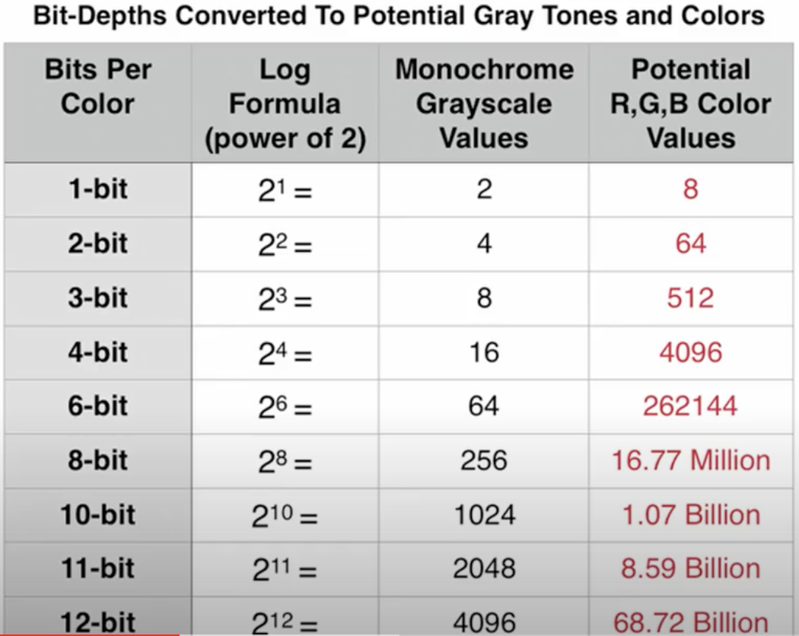

# Multimedia Overview

- Video and audio is stored in a compressed state and then decompressed when used
    - Can be lossless compression or lossy compression depending on the encoding algorithm (codec)
    - Compression is an NP-hard problem so approximation algorithms are often used

## Glossary

- *Spatial Resolution*- number of pixels in a single frame 
    - higher spatial resolution -> sharper image (more information)
    - Pixel width x pixel height
        - Standard Definition (SD)- 640 x 480 
        - High Definition (HD)- 1280 x 720 
        - Full HD (1080p)- 1920 x 1080
        - Ultra HD (4k)- 3840 x 2160
- *Color Depth*- the number of bits used to represent the range of possible colors for a single pixel
    - 
    - Our eyes can perceive more colors than 8-bit so in-between shades/colors get lost in videos using 8-bit or less color depth
    - 

- *Framerate*- number of images that make up 1 second of video  
    - Measured in frames per second (FPS)
    - 24 FPS- standard for movies (feels smooth and cinematic)
        - technically 23.98 FPS 
    - 30 FPS- TV broadcasts
    - 48+ FPS can feel hyper-realistic as if you are there
    - Framerate of a video has a major effect on how it is perceived by audience
- Raw data / sec = spatial resolution x color depth x frame rate
    - *Bitrate*- data throughput in terms of bits / second
        - higher bitrate ~ higher quality but larger files
        - Mbps- megabits per second
        - Kbps- kilobits per second
        - bitrate and resolution are not exactly synonymous 
- [Resolution vs. Bitrate vs. FPS](https://www.youtube.com/watch?v=_XzGhc9mPVk)

## Video Coding Formats

- A video coding format is a specification that is implemented by a *codec* 
- *Transcoding*- process of transforming an input from one format to another
- Advanced Video Coding (AVC)/H2.264 --> High Efficiency Video Coding (HEVC)/H.265 
    - 25-50% smaller video files at cost of triple the resources to encode
    - Royalties for H.265
- VP8 --> VP9 --> AV1 
    - Open source and royalty free

## Audio Coding Formats

- MP3- saves space by taking advtange of what our ears do not hear
- Advnaced Audio Coding (AAC)- most popular and more efficient than MP3 
- AC-3- multiple audio channels (unlike AAC)

## Multimedia Contianers

- Hold the video & audio stream along with any metadata files for things like captions
    - the video and audio are encoded using one of the above formats 
- MP4 and AVI are popular ones

## Animation

- Animated films typically 24 FPS
- Animating on ones- different image for each frame
- Animating on twos- images are kept for 2 frames
    - more crunchy feel 
    - longer and more pronounced poses
- Spiderman Into the Spiderverse used both 
    - animated on ones for faster more skilled seeming shors and on twos for slower more struggling shots
    - used motion smearing instead of blurring to give more comic book feel
- [Spider-man Into the Spiderverse Animation](https://www.youtube.com/watch?v=jEXUG_vN540)