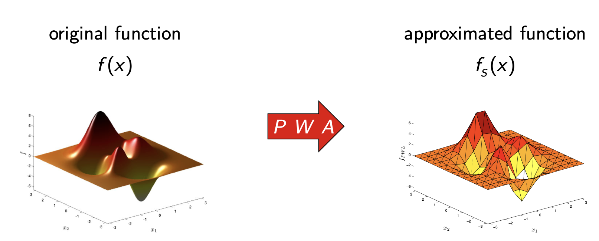
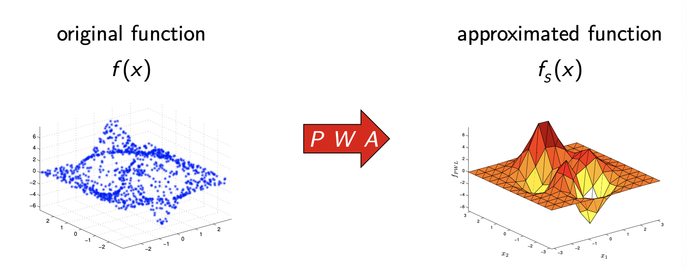

# Overview
Optimization is a huge field with a tremendous number of applications. It is also intertwined in ML so that is why its include in the ML notebook. Here is where I will try to keep a working glossary of areas I am being introduced to with a brief overview of what they are. Being able to map out how many pieces of a field fit together greatly helps me when diving deeper into any one area.

## What is Optimization?
Optimizing simply stands for finding the maximum or minimum of a function. This max or min is often subject to a series of constraints. The form of the function being optimized and the constraints being adhered to (e.g. linear, nonlinear, continuous, etc.) determines the type of problem and thus the technique used to solve them. 

Here is the mathematical definition of an optimization problem: 

$$\min f_0(x) $$
subject to the contraints:
$$ f_i(x) \leq b_i$$

[Here](https://web.stanford.edu/~boyd/cvxbook/bv_cvxbook.pdf) is the textbook on convex optimization used for reference.

---
## Linear Programming (LP)
Optimizing a linear objective/cost function subject to linear equality/inequality constraints 

---
## Nonlinear Programming (NLP)
Optimizing an objective/cost function over a set of real variables subject to system of equations called constraints (more general class that includes LP)

### Quadtratic Programming (QP)
Methods for optimizing a quadtratic objective function subject to linear constraints

---
## Sequential Programming

### Sequential Quadtratic Programming (SQP)
Involves solving a series of subproblems where each is a quadratic program

### Sequential Linear Quadtratic Programming (SLQP)
Involves solving a linear program and equality constrained quadratic program at each step

---
## Dynamic Programming (DP)
Involves breaking down the main optimization problem into simpler sub-problems.

The **Bellman Equation** describes the relationship between the value of the larger problem and the values of the sub-problems

---
## Piece Wise Affine Functions (PWAs)
Approximates a function using a series of lines in 2D, planes in 3D, & hyperplanes in higher dimensional spaces. 

While the picture above shows the PWA given a known function, PWAs are most often used when there is a set of datapoints representing the functions inputs and outputs. The task is then to construct a PWA from the data such that it best approximates the true function that is mapping the inputs to the outputs.

Once you have a PWA made from your dataset, you can then make predictions on new inputs as to what the true function would map to.

---
## Constraints
- A constraint is a condition of an optimization problem that the solution must satisfy

- **Feasible Set**- is the set of candidate solutions that satisfy all constraints
    - A point is **infeasible** if it does not satisfy a constraint
    
- A constraint is **binding** if an inequality constraint holds with equality at the optimal point
    - i.e. the point is at the edge of the feasible set and cannot move anymore in the direction of the constraint, even if doing so would improve the value of the objective function, since it would move outside the feasible set
    
- A constraint is **non-binding** if the point could be moved in the direction of the constraint
    - i.e. the point is not at the edge of the feasible set and can be moved more in the direction of the constraint, however doing so would not be optimal 
    
    - This can mean under certain conditions that the optimization problem would have the same solution in the absence of the constraint since the objective function's minimum does not push up against the edge of the feasible set
    
        

## Slack Variable
- A variable added to an inequality constraint to transform it into an equality
- If the slack variable for a constraint is zero at a point, the constraint is binding there
- If the slack variable for a constraint is positive at a point, the constraint is non-binding there
- If the slack variable for a constraint is negative at a point, the point is infeasible as it does not satisfy the constraint (can be thought of as outside the feasible set)
    - Slack variables can never be negative for most interior point and simplex solvers 
- For example, introducing the slack variable $y \geq 0$, the inequality constraint of $Ax \leq b$ can be transformed into an equality of $Ax + y = b$
- Intuition: slack can be thought of like a distance from a candidate solution to the constraint boundary ($y = Ax - b$)
- A constraint of $Ax > b$ will be transformed into two constraints of $s = Ax - b$ and $s > 0$ that is used by most solvers

---

## Lagrange Multipliers
- KKT conditions generalize the method of lagrange multipliers and allow inequality constraints