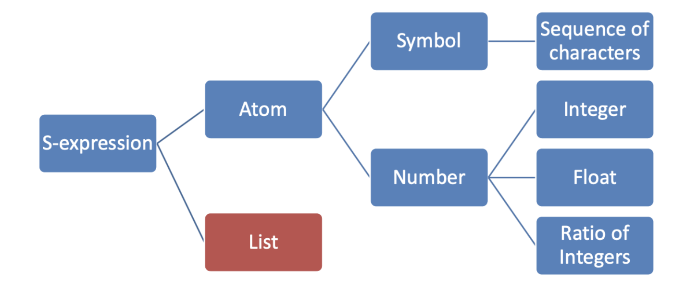

# Functional Languages

- Lambda expressions describe nameless functions
    - Applied to parameters by placing the parameters after the expression
    - Ex: $(\lambda(x) x * x * x)(2)$ evaluates to 8
- Functional Form
    - Higher order functions
        - lambda expressions are also useful for creating functions to pass as parameters to other functions that expect to receive functions
        - can return other functions
    - Composition of Functions
        - Takes two functions as input and returns a new function that is the result of the 1st function appleid to the second
        - Ex: $h := f \odot g$ which means $h(x) = f(g(x))$
- Inefficient execution on von neumann machines
- Simple syntax and semantics
- Programs written in funtional languages can automatically be made concurrent
    - harder to write concurrent imperative languages

## LISP

### History

- Developed in 1958-59 for use in AI 
    - designed @ MIT by John McCarthy
    - Fortran didnt have recursion, the ability to manipulate symbols, and ability to process data in linked lists rather than arrays 
- Based on lambda calculus and mathematical functions
- Interpreted language with garbage collection

### Data Types

- Originally only atoms and lists
- Type is bound at runtime
- Names not variables (can't change value of a name after it has been defined)
- list form- parenthesized collection of atoms and/or sublists

### Interpretation

- function defintions, function applications, and data all have the same form 
- `(A, B, C)` can be interpretted differently depending on the context
    - `A` can be a function being called with params `B` and `C`
    - `A` can be a function called on `B` evaluated at `C`
    - It can be a list of three atoms `A`, `B`, `C`

### Syntax



- a series of *symbolic expressions* (or S-expressions)
    - can be an atom or a list 
- an atom can be a number or a symbol
    - a symbol can be a sequence of characters
    - a number can be integers, floats, or ratio of integers (allows us to maintain accuracy with division)
- a list is recursively defined in termso of s-expressions

### Grammar

- very simple grammar described by a short EBNF

```
<s_expression> -> <atomic_symbol>
								| "(" <s_expression> "." <s_expression> ")"
								| <list>
				<list> -> "(" <s_expression>* ")"
<atomic_symbol> -> <letter> <atom_part>
		<atom_part> -> empty | <letter> <atom_part> | <number> <atom_part>
			<letter> -> "a" | "b" | ... | "z"
			<number> -> "1" | "2" | ... | "9"
```

### Semantics

- 1st s-expression in a list is the name of a function
    - Ex: `(foo)` or `(foo a b c)`
- in a function call, all arguments are evaluated first, then the function is applied to the result
- Prefix notation

### Primitive/Numeric Functions

- true: `#T` or `#t`
- false `#F` or `#f`
-  `=`, `>`, `<`, `<=`, `>=`
- `and`, `or`,`not`
- `equal?`, `even?`, `odd?`, `zero?`, `negative?`, `number?`
- `abs`, `sqrt`, `modulo`, `remainder`, `min`, `max`, `expt`

### Special Forms

- Functions that don't evaluate their arguments

#### lambda Expressions

- describe nameless/anonymous functions
- functions are first-class entities meaning they can be values of expressions, elements of lists, passed as parameters, and returned from functions 
- functions can b
- `(lambda(x) (* x x))` creates a special lambda function
- can be called by: `((lambda(x) (* x x)) 8)`

#### define

- 2 uses:
    1. bind a symbol to an expression: `(define pi 3.14)`
    2. bind names to lambda expressions (lambda is implicit): `(define (square x) (* x x))`

#### if

-  two way selector function
- `(if predicate then_exp else_exp)`

#### cond

```scheme
(cond 
 [predicate1 expression1]
 [predicate2 expression2]
 ...
 [else expression])
```

- else clause is optional 
    - synonymous with `(#t expression)`

### Lists

- Stored internally as singly-linked lists
- `quote` function (abbreviated w/ apostrophe prefix operator) takes one param and returns the param without evaluation 
    - `'(A B) <=> (quote (A B))`
- `car`- returns first element of its list parameter
- `cdr`- returns the remainder of the list parameter after removing the 1st element
- `cons`- add a new head to the front of a list
    - returns a new list with first argument inserted onto the front of the 2nd argument 
    - does not make copy of the second argument 
- `list`- returns a new list of its parameters 
    - `(list 'a 'b 'c 'd)` -> `'(a b c d)'`
- `(list '(A B) '(C D))` equivalent to `(cons '(A B) (cons '(C D) '()))`
- `null?`- tests for empty list 
    - `(null? '())` ->`#t`
    - `(null? null)` -> `#t`
- `list?`- tests if the function is a list 
    - `(list? 'A)` -> `#f`
    - `(list? '(A))` -> `#t`
- `append`- returns new list that contains all elements of the two list arguments
    - *the arguments must be lists unlike `list` and `cons`*
    - different result from `list` function
        - `(append '(a b) '(c d))`
- contractions are useful for doing a lot of work concisely 
    - `(cadr lst)` equivalent to `(car (cdr lst)` (i.e. getting 2nd element)
    - `(cdddr lst)` equivalent to `(cdr (cdr (cdr lst)))` (i.e. removing first 3 elements)
- `length`- returns the length of a list 
- Lists are processed in a recursive fashion 
    - process head of list, recurse down rest of list, base case is empty list 
- Deep Recursion- recurse the list and also recurse down any sublists
    - the `equal` function below is an example 

``` scheme
(define (equal list1 list2)
  (cond
    [(not (list? list1)) (eq? list1 list2)]
    [(not (list? list2)) #f]
    [(null? list1) (null? list2)]
    [(null? list2) #f]
    [(equal (car list1) (car list2)) (equal (cdr list1) (cdr list2))]
    [else #f]))
```

## Interpreter

- Infinite read-evalutate--print loop (REPL)
    - similar to python and ruby
- parameters are evaluated in no particular order 
    - order of parameter evaluation doesn't matter since each function has no side-effects
- extensive use of parenthesis makes turning a program text into a parse tree very easy 
    - also no need for operator precedence

## History

- LISP -> Scheme (70s) -> racket 
    - lisp also broke off into a more complex language CommonLisp 
- Scheme
    - cleaner, more modern, and simpler than contemporary dialects of scheme
    - only static scoping 

## Local Bindings

- 4 ways to define local bindings (each w/ diff semantics):
    1. `let`- expressions are all evaluated in the environment from before the let expression
    2. `let*`- expressions are evaluated in the environment produced from the *previous bindings* (can use bindings from previous expressions)
    3. `letrec`- used for recursion 
    4. `define`- nested local defines are preferred racket style but don't have the emphasis in the distinction 
- use the one most convenient, but default to `let`
- Let-expressions can appear anywhere
- Help avoid doing repeated work in functions
- let is shorthand for a lambda expression applied to a parameter
    - `let ([alpha 7]) (5 alpha)` equivalent to `((lambda (alpha) (* 5 alpha)) 7)`

## Tail Recursion

- Recursion is the natural method of computation in functional languages
- Usually the overhead of function calls makes recursion slower than iteration
- Most functional languages can optimize *tail recursive* calls to make them as efficient as iteration
- C and Racket have tail recursion while python does not 
- Tail Recursive Function- when there is nothing to do after the function returns except return its value
    - Can be automatically converted by a compiler to use iteration (makes it faster)


**Normal Factorial Recursive:**

- Each call must wait for the result of calling itself in order to do the work of multiplying with n

``` scheme
(define (fact n)
  (if (<= n 0) 1 (* n (fact (- n 1)))))
```

**Factorial Tail Recursion:**

- Each call's work is done once it calls itself again recursively

```scheme
(define (fact n)
  (define (helper n acc)
  	(if (<= n 0)
        acc
        (helper (- n 1)(* n acc))      
  ))
  (helper n 1)
)
```


## Higher Order Functions

- A function that can take functions as parameters and/or return functions as results
- Map and reduce higher order functions form basis of MapReduce (Hadoop) for large scale computing tasks 

### Compose

- combines two functions into a new function 

``` scheme
(define (g x) (* 3 x))
(define (f x) (+ 2 x))
(define h (compose f g))
(h 5) ; returns 17
```

- can be written as `(define (compose func1 func2) (lambda (x) (func1 (func2 (x))))`

### Filter 

- takes a predicate function as its first param (often as lambda exp)
- returns a ist with those items from the param list that satisfy the predicate

``` scheme
(define (smaller100 x) (< x 100))
(filter smaller100 '(25 1 711 50 100))
; returns (25 1 50)
```

### Map

- Takes two params- a function and a list(s)
- Applies the function to each element on the list and returns a list of the results

``` scheme
(define (map func lst) 
  (if (null? lst) 
      '() 
      (cons (fun (car lst)) (map fun (cdr lst)))))
```

- the `map` function provided by racket is more general and powerful
    - `(map fun lst1 lst2 .. lstn)`

### Foldr

- Combines all elements in a list by applying a binary operation 
- Known as reduction or fold

``` scheme
(foldr f b '(x1 x2 ... xn))
; returns (f x1 (f x2 ... (f xn b) ...))
```


