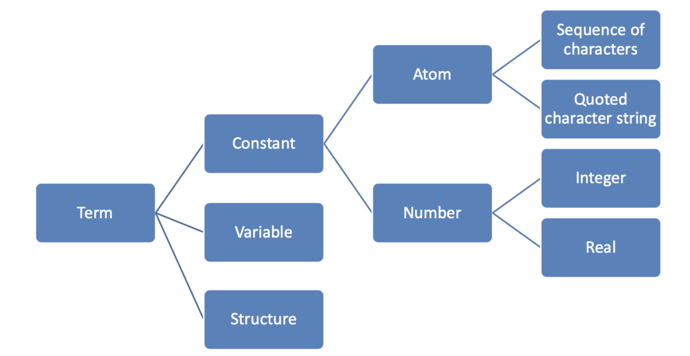

# Logical Languages

- Programs are expressed in a form of symbolic logic
- Use logical inferencing process to produce results 
- Declarative rather than procedural
    - you describe a result/goal and you get it via a blackbox 
    - compared to procedural where you describe the steps to get to a result
    - [Declarative vs. Procedural](https://stackoverflow.com/questions/1619834/what-is-the-difference-between-declarative-and-procedural-programming-paradigms)

## Symbolic Logic

- Express propositions 
- Express relationships btw propositions
- Describe how new propositions can be inferred from other propositions
- First Order Predicate Calculus is the form symbolic logic used for logic programming
- Operators: connect 2+ atomic propositions 
    - conjunction, disjunction,  negation, implication 
- Quantifiers: include variables in propositions
    - universal $\forall$
    - existential $\exists$ 

## Clausal Form

- A standard form for propositions that helps with organization
- Restriction on how statements can be formatted allows logic programming systems to prove theorems mechanically
- If all A's are true, then at least one B is true
    - $B_1 \cup \dots \cup B_m \subset A_1 \cap \dots \cap A_n$

### Horn Clauses

- Further restriction that insists all statements be in the form of a head (LHS) and a body (RHS)
- the head is a single atomic proosition (or term in prolog)
- the body is a list of atomic propositions (or terms in prolog)
- the conjuction of the terms in the body *implies* the head
    - $B \subset A_1 \cap \dots A_n$ 
- a clause with no body is a fact
- a clause with both sides is a rule
- a clause with no head is a goal/query

## Resolution Principle

- Formalized by Alan Robinson in 1965
- How implications can be combined to obtain new implications
    - Ex: If `clause1` implies `clause2` and `clause2` implies `clause3` then `clause1` also implies `clause3`

## Prolog

- First appeared in 1972
- Provide 
    1. facts/axioms (the knowledge base)
    2. rules/theorems (if condition, then also conclusion)
    3. goals/hypothesis (queries)
- Can be thought of declaratively or imperatively
- `parent(kim, holly)` defines a predicate `parent` of arity 2 (sometimes written as `parent/2`)

### Terms



### Process

- State a series of *facts* and *rules* that the interpreter collects in its *DATABASE*
- Pose a *query/goal* and Prolog attempts to find inference steps (and assignments of values to variables) that allow it to prove your query starting from the *facts*

#### Facts

- Knowledge base to build new rules from (aka the world or the universe)
- Horn clauses with no body

``` prolog
mother(mary, fred). % predictate making mary a mother of fred
```

#### Rules

- Describe known implications/relations
- Rules are theorems that allow the interpreter to infer things
- Horn clauses with both a head and body
- To be interesting, rules generally contian *variables*
- Ex: If X barks, then X is a dog
    - Horn Clause: dog(X) $\subset$ barks(X)
    - Prolog Syntax: `dog(X) :- barks(X).`
- Ex: For all X, X is emplyed if there exists a Y such that Y employs X 
    - `employed(X) :- employs(Y, X)`
    - Does NOT say that X is employed only if threre is a Y that employs X

#### Goals

- Query/reasoning about the world 
- Prolog attempts to satisfy the goal

##### Unification

- Process by which compatible statements are merged
- Query asked is the interpreter's original goal
- In an attempt to satisfy the goal, interpreter looks for facts or rules with which the goal can be unified
- Trivial unification: goal can be unified with itself 
- A variable without a value yet but which corresponds to a constant/value in another clause gets instantiated with that value
    - Ex: `studies(charlie, X)` is unified with the fact `studies(charlie, cs3270)` and the variable `X` is instantiated to `cs3270`

### SWI Prolog

- Prompt a query with `?- `
- `consult` is a predefined pedicate to read a program from a file into the database (load in a knowledge base and rules from a `.PL` file)
    - `?- consult('database.pl')`
- Goal:

```
?- barks(X).
X = fido.

?- dog(fido).
true.
```

```
woman(jean).		% fact 
man(fred). 			% fact
wealthy(jean). 	% fact 
happy(Person) :- woman(Perosn), wealthy(Person)
```

- `jean` and `fred` are constants/atoms b/c they start w/ lowercase letter

- `Person` is a variable b/c it starts w/ uppercase letter (could also just be an underscore)

- Wil return first answer it finds to a query

    - Press Y or Enter if thats all you want
    - Press ; N or Spacebar if you want prolog to continue searching for other possible answers

- Pressing `a` aborts anything and returns you to the prompt 

- When entering a query if the value of an arugment doesn't matter to you use `_` 

    

### Conjunction & Disjunction

- Rules & Conjunction (AND): `B(X) :- A(X), C(X), D(X).`

- Rules & Disjunction (OR):

- ```` 
    B(X) :- A(X).
    B(X) :- C(X).
    B(X) :- D(X).
    ````

- Can combine disjunction and conjunction using the above syntax

### Variable Scope

- Variable scope is the clause in which it appears
    - appears first on LHS -> universal quantifier
    - appears first on RHS -> existential quantifier
- Ex: `grandmother(A, C) :- mother(A, B), mother(B, C)`
    - For all A, C [A is the grandmother of C if there exists a B s.t. A is the mother of B and B is the mother of C]

### How Prolog Works

- Interpreter starts at beginning of database and looks for soemthing to answer current goal with
    - If it finds a fact, it succeedds
    - If it finds a rule, it attempts to satisfy the terms (or subgoals) in the body/rhs *left-to-right* and *depth first*
    - this ordering is prolog specific, not logic programming in general
- when attempting resolutions
    1. interpreter pushes *current goal* onto a stack
    2. makes the first term/subgoal in the body the current goal 
    3. Goes back to the beginning of the database and starts looking again
- if interpreter gets thorugh first term/goal of a body succesfully, it continue with the next one
- if interpreter gets all the way through the body, the goal is satisfied and backs up a level and proceeds 
- if interpreter fails to satisfy the terms in the body of a rule, the interpreter undoes the unification of the lhs (includes uninstantiating any variables given values as a result of the unification)
    - backtracks and keeps looking through the database for something else with which to unify
- if interpreter gets to end of database without succeeding, it backs out a level and continue from there
- Ordering of database and left-to-right pursuit of subgoals makes prolog not purely declarative
    - changing order of statements in database can give different results (including infinite loops or less efficiency)

### Infinite Recursion

- Can occur since order matters in rule evaluation
- Can usually avoid by following 2 best practices:
    - make rules right recursive 
    - put base cases first 

## List Processing

- Enclosed in squre brackets w/ elements separated by commas
- `|` operator separates head of list from rest of list
- `=` means unification

``` 
?- [H | T] = [1, 2, 3, 4, 5].
H = 1.
T = [2, 3, 4, 5].
```

- Can construct litss using the same syntax as destructing lists:

```
?- Lst = [1 | [2, 3, 4, 5]].
Lst = [1, 2, 3, 4, 5].
```

- predicates for list processing:

    - `member`- performs a membership test 

        - implemented as:

        - ```
            member(X, [X|_]).
            member(X, [_|Xs]) :- member(X,Xs)
            ```

    - `append`- append 2 lists

    - `remove`- remove 1st occurence from a list

    - `filter`- keep only elements that satisfy a predicate 

- Assign `H1` and `H2` to the first two elements of a list

```
?- [H1 | [H2 | T]] = [1, 2, 3, 4]
H1 = 1,
H2 = 2,
T = [3, 4].

% or 

?- [H1,H2|T] = [1, 2, 3, 4].
H1 = 1,
H2 = 2,
T = [3, 4].
```

- Prolog predicates only return `true/false` depending on whether the predicate can be satisifed or not
- To return a value from a rule/predicate, an additional parameter is needed to carry back the result
    - Ex: `append([a,b,c], [d,e,f], Lst)` `Lst` is the output paremeter that contains the two input lists appended together

```
% my_append -- Appends two lists.

my_append([], Lst2, Lst2).
my_append([Head|Tail], Lst2, [Head|Result]) :- my_append(Tail, Lst2, Result).

% my_remove -- Remove the first occurrence of an item from a list.

my_remove(_, [], []).
my_remove(Item, [Item|Tail], Tail).
my_remove(Item, [Head|Tail], [Head|Result]) :- Item \== Head, my_remove(Item, Tail, Result).
```

## Logical Problems

- Prolog is great for solving logic problems
- also known as constraint programming

### 8 Queens Problem

- Represent a queen's position with `queen` predicate (e.g. `queen(2, 5)` means there is a queen at position (2,5) on the board)
- We want a list containing 8 elements with the position of each queen

``` 
nocheck(_, []). # base case of empty list
nocheck(X/Y, [X1/Y1 | Rest]) :- 
	X =\= X1, #not in same row
	Y =\= Y1, #not in same column
	abs(X - X1) =\= abs(Y - Y1), # not in same diagonal
	nocheck(X/Y, Rest).


legal([]). # base case of empty list
legal([X/Y | Rest]) :- 
	legal(Rest),
	# try all possible positions of (x,y)
	member(X, [1, 2, 3, 4, 5, 6, 7, 8]),
	member(Y, [1, 2, 3, 4, 5, 6, 7, 8]),
	nocheck(X/Y, Rest).
```

```
# we want only the lists of size 8 (dont return all the others)
X = [_, _, _, _, _, _, _, _], legal(X). 

# further restrict outputs to be in the desired order
X = [1/_, 2/_, 3/_, 4/_, 5/_, 6/_, 7/_, 8/_], legal(X). 
```

