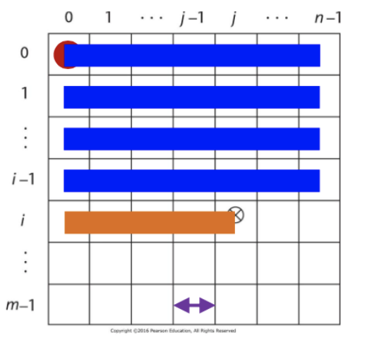

# Data Types

- Defines a set of possible values (the domain) and the pre-defined operations
- Defines how to interpret bit strings of various lengths

## Primitive

- *Integer*- almost always an exact reflection of hardware
    - python has unlimited precision ints (other languages limit based on number of bits)
- *Floats*- model real numbers (but only as approximations)
    - IEEE Floating Point Standard 754
    - float- usually 32 bits
    - double- double the precision so often 64 bits
- *Complex*- two floats (1 real, 1 complex)
- *Decimal*- attempts were made to store a fixed number of decimal digits in coded form (Binary Coded Decimal) where each digit is encoded separately but was overall a failure 
    - Pros: increased accuracy since each digit is represented by 4 bits
    - Cons: limited range, wastes memory, not all CPUs have direct hardware support
    - Used by business applications for representing money (e.g. C# has a double and decimal type which has more precision)
- *Boolean*- implemented as a byte due to byte-addressable memory (can't address single bits)
    - Pros: readability in logic expressions (as opposed to interpreting numeric expressions)
- Character- 
    - ASCII is a 7-bit character set which is limited and inadequate in the modern age
    - UNICODE 
        - initially fixed 16-bit representation 
        - includes the base multilingual plane for non-roman characters
        - backwards compatible with ASCII
        - still inadequate
    - UTF-8 
        - variable length for bit representation 
        - most widely used

## Strings

1. Static Length
    - compile time descriptor includes the length
    - Descriptor- collection of attributes of a variable
        - can be static- maintained by compiler (e.g. C++)
        - or can be dynamic- managed at runtime (e.g. Python)
2. Limited Dynamic Length 
    - run time descriptor includes the maximum length and the current length 
3. Dynamic Length

## Ordinal Types

- Type in which the range of possible values can be easily mapped to the set of positive integers
- primitive ordinals in java: integer, char, boolean

## Enumeration Types

- user-defined ordinal type
- all possible values, which are amed constants, are provided in the definition
- Pros:
    - readability 
    - reliability- compiler can perform checks

## Array Types

- Array- an aggregate of *homogeneous data* elements where individual elements are identified by position relative to the first 
- indexing/subscripting an array is a mapping from indices to elements 
    - some languages like Ada, Fortran, and Matlab use () instead of []
- index range checking is done:
    - by default: C#, Java, Go
    - Not at all: C, C++, Fortran
- *heterogeneous array*- one in which elements need not be the same type 
    - JS, Perl, Python, Ruby
    - heap-dynamic arrays
    - oftentimes array elements only contain references to the data stored

### Subscript Binding & Array Categories 

#### Static

- Statically bound subscript ranges 
- Static storage allocation 
- Increased efficiency b/c no dynamic (de)allocation
- C, C++ arrays that include `static` 

#### Fixed Stack-Dynamic

- Statically bound subscript ranges
- Storage allocation done at declaration elaboration time
- Increased space efficiency b/c space can be reused during runtime
- C, C++ arrays without`static`

#### Fixed Heap-Dynamic

- Static binding of subscript ranges
- Dynamic storage binding when requested at runtime

#### Heap-Dynamic 

- Dynamic binding of subscript ranges
- Dynamic storage allocation 
- Can change any number of times (more flexible)

### Array Implementation

- access function for single-dim array:

```
address(a[k]) = 
	address(arr[lower_bound]) + ((k - lower_bound) * element_size)
```

- access function for multi-dim array:

``` 
address(a[i,j]) = 
	address(a[row_lb, col_lb]) 
	+ (((i - row_lb) * n) + (j - col_lb)) * element_size 
```



- the lower bounds are zero in 0-indexed languages and 1 in 1-indexed languages
- Storing Arrays in Memory:
    - Row-Major order (used by most languages)
    - Column-Major order (Fortran & Matlab)
    - knowing which affects speed of code
        - row major order means you should process by row to reduce cache misses since cache might store only 1 row at a time
        - cache misses and even page swaps are expensive with large matrices

### Associative Arrays

- Unordered collection of data elements indexed by keys 
- maps arbitrary indices to values
- elements are (key, value) pairs
- often implemented as hash tables