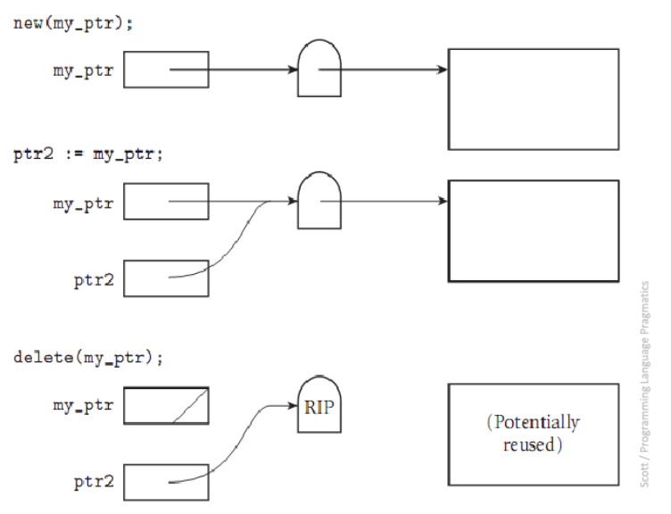
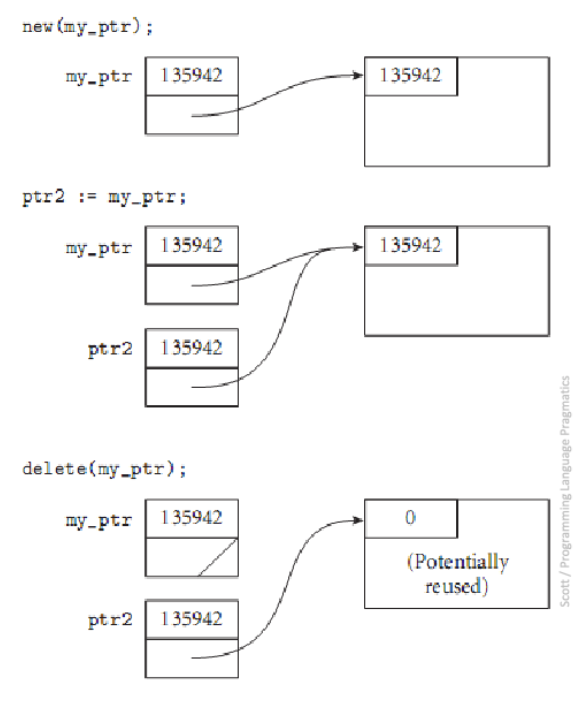

# Data Types

- Defines a set of possible values (the domain) and the pre-defined operations
- Defines how to interpret bit strings of various lengths

## Primitive

- *Integer*- almost always an exact reflection of hardware
    - python has unlimited precision ints (other languages limit based on number of bits)
- *Floats*- model real numbers (but only as approximations)
    - IEEE Floating Point Standard 754
    - float- usually 32 bits
    - double- double the precision so often 64 bits
- *Complex*- two floats (1 real, 1 complex)
- *Decimal*- attempts were made to store a fixed number of decimal digits in coded form (Binary Coded Decimal) where each digit is encoded separately but was overall a failure 
    - Pros: increased accuracy since each digit is represented by 4 bits
    - Cons: limited range, wastes memory, not all CPUs have direct hardware support
    - Used by business applications for representing money (e.g. C# has a double and decimal type which has more precision)
- *Boolean*- implemented as a byte due to byte-addressable memory (can't address single bits)
    - Pros: readability in logic expressions (as opposed to interpreting numeric expressions)
- Character- 
    - ASCII is a 7-bit character set which is limited and inadequate in the modern age
    - UNICODE 
        - initially fixed 16-bit representation 
        - includes the base multilingual plane for non-roman characters
        - backwards compatible with ASCII
        - still inadequate
    - UTF-8 
        - variable length for bit representation 
        - most widely used

## Strings

1. Static Length
    - compile time descriptor includes the length
    - Descriptor- collection of attributes of a variable
        - can be static- maintained by compiler (e.g. C++)
        - or can be dynamic- managed at runtime (e.g. Python)
2. Limited Dynamic Length 
    - run time descriptor includes the maximum length and the current length 
3. Dynamic Length

## Ordinal Types

- Type in which the range of possible values can be easily mapped to the set of positive integers
- primitive ordinals in java: integer, char, boolean

## Enumeration Types

- user-defined ordinal type
- all possible values, which are amed constants, are provided in the definition
- Pros:
    - readability 
    - reliability- compiler can perform checks

## Array Types

- Array- an aggregate of *homogeneous data* elements where individual elements are identified by position relative to the first 
- indexing/subscripting an array is a mapping from indices to elements 
    - some languages like Ada, Fortran, and Matlab use () instead of []
- index range checking is done:
    - by default: C#, Java, Go
    - Not at all: C, C++, Fortran
- *heterogeneous array*- one in which elements need not be the same type 
    - JS, Perl, Python, Ruby
    - heap-dynamic arrays
    - oftentimes array elements only contain references to the data stored

### Subscript Binding & Array Categories 

#### Static

- Statically bound subscript ranges 
- Static storage allocation 
- Increased efficiency b/c no dynamic (de)allocation
- C, C++ arrays that include `static` 

#### Fixed Stack-Dynamic

- Statically bound subscript ranges
- Storage allocation done at declaration elaboration time
- Increased space efficiency b/c space can be reused during runtime
- C, C++ arrays without`static`

#### Fixed Heap-Dynamic

- Static binding of subscript ranges
- Dynamic storage binding when requested at runtime

#### Heap-Dynamic 

- Dynamic binding of subscript ranges
- Dynamic storage allocation 
- Can change any number of times (more flexible)

### Array Implementation

- access function for single-dim array:

```
address(a[k]) = 
	address(arr[lower_bound]) + ((k - lower_bound) * element_size)
```

- access function for multi-dim array:

``` 
address(a[i,j]) = 
	address(a[row_lb, col_lb]) 
	+ (((i - row_lb) * n) + (j - col_lb)) * element_size 
```


- the lower bounds are zero in 0-indexed languages and 1 in 1-indexed languages
- Storing Arrays in Memory:
    - Row-Major order (used by most languages)
    - Column-Major order (Fortran & Matlab)
    - knowing which affects speed of code
        - row major order means you should process by row to reduce cache misses since cache might store only 1 row at a time
        - cache misses and even page swaps are expensive with large matrices

### Associative Arrays

- Unordered collection of data elements indexed by keys 
- maps arbitrary indices to values
- elements are (key, value) pairs
- often implemented as hash tables

## Composite Types

- Aggregate of possibly different data elements in whih the individual elements are identified by names
- struct in c/c++ & go, named tuple in python 
- from OOP pov, classes are a composite type

## Union Type

- type whose variables are allowed to store different type values at different times during execution

- free union- when there is no language support for type checking in the union construct (e.g. C, C++) so it allows you to create unsafe code 
    - reason why C,C++ are not strongly typed

- discriminant- type indicator required to be included in a union in certain languages like ML, Haskell, F#

- Java and C# don't support unions due to safety concerns 

## Pointer Types

- Variable that takes on values of memory addresses or a special value `null`
    - Indirect addressing- using a pointer to step through an array 
    - Dynamic memory- can access memory locaitions on the heap

- 2 operations:
    1. Assignment- set a pointer variable's value to a memory address
    2. Dereferencing- get the value stored at the memory address represented by pointer's value
        - Can be done explicitly or implicitly 
- Dangers:
    - Dangling Pointers- pointer points to heap-dynamic variable that has been deallocated
    - Memory Leak- allocated heap-dynamic variable that is no longer acessible to the user program
    - Buffer Overflows- no bounds checking on pointers when using with arrays

- Necessary for dynamic data structures 

### Reference Types

- C++ has special kind of pointer type that is used primarily for formal parameters
    - has the advantages of *both* pass-by-pointer and pass-by-value
- Java uses only references and replaces pointers entirely
- C# uses references but also allows pointers in `unsafe` methods 

### Solutions for Dangling Pointers

- Tombstones 
    - An extra heap cell is allocated as a pointer to the actual heap-dynamic variable
    - Any pointers pointing to the heap-dynamic variable actually point at its tombstone
    - If any pointer deallocates the variable, the tombstone is set to null so other pointers now point to null instead of a re-allocated memory address (safer but can still get nullptr dereferencing errors)
    - Costly in time and space
    - Similar idea to smart pointers




- Locks-and-Keys
    - Pointer values are represented as (key, address) pairs 
    - Heap-dynamic variables are represented as variable plus a cell for an integer lock value
    - When a variable is allocated, the lock value is created and plaed in the lock cell *and* the key of the pointer
    - Each dereference must compare the key and the lock



- No explicit deallocation permited by the language (e.g. Rust & Java)

## Heap Management/Garbage Collection

- Complex runtime process
- Two approaches:
    1. Eager- reclamation is gradual/continual (e.g. referenece counters)
    2. Lazy- reclamation occurs when the list of variable space becomes empty or low (e.g. mark-sweeep & stop-n-copy)
- Java uses combination of both techniques

### Reference Counter

- Maintain a counter in every cell which stores the number of pointers currently pointing at the cell
- Reclaim cells when their count drops to zero
- Pros:
    - Incremental, so no significant delays in app's execution
- Cons:
    - Space Required
    - Execution time required
    - Complications for cells connected in a cycle

### Mark-and-Sweep

- Recursively follow all "live" pointers, marking all discovered structures as useful
- Sweep over the entire heap and reclaim any structures not marked as useful (turn off markers in prep for next time)
- Pros:
- Cons:
    - space required
    - execution time required

### Stop-and-Copy

- Splits heap memory in half
- All new allocations go into the active half
- At collection time, recursively follow all live pointers and copy all discovered structures to the other half, which becomes the active half
- The inactive half now only contains garbge and is reclaimed all at once

### Generational Copiers

- Exploit fact that many objects have short lives while others have long lives
- Keep track of lifetimes (how many collection passes they have survived) and collect long lifetime objects less frequently

### Escape Analysis

- Determines if any references to a value escape the function where the value i declared
- If no references escape, the value can be stored on the stack
- Values stored on the stack don't need to be allocated/freed
- Java and Go do this

```java
// car object would be stored on the stack
public String getCarDesc(){
  Car car = new Car();
  String desc = car.genDesc();
  return desc;
}	
```

## Type Checking

- ensure operands of an operator are of compatible types
    - include subprogram parameters and assignment statements
- If type bindings are static, type checking can be static (i.e. at compile time)
- If type bindings are dynamic, type checking must be dynamic
- Compatible Type- type that is legal for the operator or can be coerced (implicitly converted) by compiler generated code to a legal type
- Strongly Typed Languages- type errors are always detected at compile time or run time
    - No: C, C++
    - Almost: Java, C# (allow explicit type conversion which can fail at runtime but pass compiler)
    - Yes: F#, ML, Rust