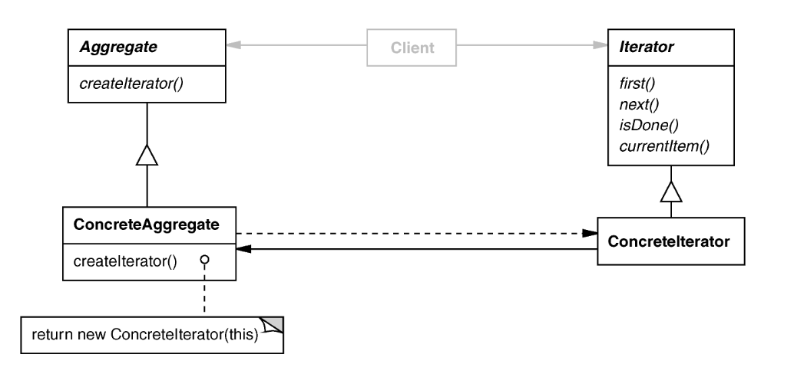

# Iterators
- Allow a program to access aggregated data in a container
    - Allow us to write programs that do not depend on the type of container (e.g. array, vector, tree, etc.)
- The details of accessing the aggregated data iis hidden via the iterator interface
- Our code then interacts with the iterator, not the container directly
- Every container has its own class for its iterator

## Iterator Design Pattern
### Intent
Access elements of a container (aggregate) without exposing its representation

### Applicability
- Require multiple traversal algorthims over a container
- Require a uniform traversal interface over different containers
- When container classes and traversal algorithms must vary independently

### Structure


- `Aggregate` is an abstract base class used for creating containers.
- `ConcreteAggregate` is a derived class that is a specific type of container (e.g. tree, hash map, list, etc.)
- `Iterator` is an abstract base class used for creating iterators on containers
- `ConcreteIterator` is a derived class that is a specific iterator implementation corresponding to the strucutre of a concrete container
- The use of `Aggregate` and `Iterator` abstract base classes lets client code be written against any generic container with an iterator
    - Looping directly over linear containers like arrays make assumption on the subscript operators definition meaning it interacts directly with the container
    - Using iterators makes algorithms more general and independent of the container since the iterators handle differencs between data structures such as linear vs tree

## STL Iterators
- C++ implementation of the iterator pattern
- Generalization of pointers since they are objects that point to other objects
- Central to generic programming b/c they are an interface btw containers and algorithms
- STL algorithms typically take iterators as arugments
    - A container only needs to provide a way to access its elements using iterators
    - Useful to add iterators to your own classes so they can be used with STL algorithms
- Not all containers support random-access (e.g. specifying the ith item to access)
- Containers that support random-access iterators can be used with all STL algos

### Input Iterators
- Used to read from a container 
- Dereferenced to refer to some object
- Incremented to obtain next iterator in a sequence
- Must allow following operations:
    - Copy Ctor and assignment operator
    - `==` and `!=` for comparison with other iterators of the same type
    - `*` and `++` for incrementing which object is being pointed to
      - Can be const
      - prefix and postfix

### Output Iterators
- Used to write to a container
- More restrictive interface:
    - `=`, `==`, and `!=` don't need to be defined
    - Must support non-const `operator*`

### Iterator Types
- Iterator categories depend on type parameterization rather than inheritance
- Iterator categories are hierarchical with more refined categories adding constraints
    - **Forward**- start to end of container (supports `++`)
    - **Bidirectional**- iterate through elements forward and backward (supports `++`, `--`) 
        - list, set, multiset, map, & multimap
    - **Random Access**- go forward n elements, get nth element (supports `[]`)
        - vector and deque 

## Using Iterators
- `begin()` is the first element
- `end()` is whatever it means to be just after the last element
- `begin()/end()` are used to traverse front to back
- `rbegin()/rend()` are used to traverse back to front
- Range based for loops use iterators to easily go through containers:

``` c++
vector<int> = {1,2,3,4};

for(int i : v) {
    std::cout << i << std::endl;
}
```