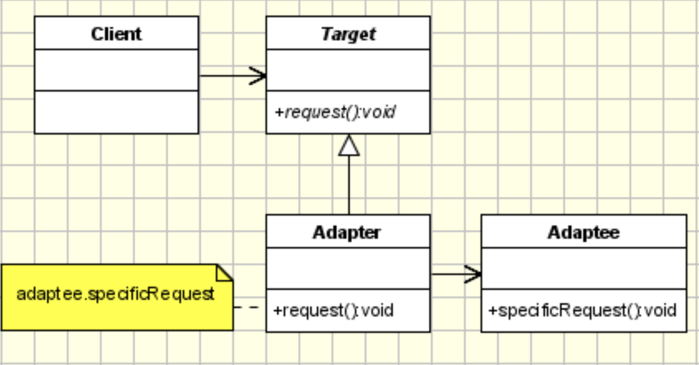

# Adapter Pattern

## Intent
- Convert a class interface into an interface expected by the cleints
- Allows classes to work together that cannot otherwise work together due to incompatible interfaces

## Applicability
- When there is a need to use an existing class, but its interface doesn't match the one needed
- When a class should be reusable so that it can cooperate with unrelated and unforeseen classes
- When there is a need to use several existing subclasses, but its not practical to adapt their interfaces by subclassing each one

## Structure


## Participants
- *Adaptees* are the class interfaces being given a new interface 
- *Target Interface* is the new interface for the client to use

## Consequences
- (+) A single adapter can work with multiple adaptees
- (-) Can make it harder to override adaptee behavior

## Implementation
- Considerations:
    - How much adapting to do?
    - Focus on a good client experience
    - Pluggable adapters- dynamicly create and change different types of adapters at runtime

## Sample Code

**Legacy Interface:**
``` c++
class Alpha {
public:
  // No hope of polymorphism
  ~Alpha() { std::cout << "Alpha::dtor" << std::endl; }
  void doThis() { std::cout << "Alpha::doThis()" << std::endl; }
};

class Beta {
public:
  ~Beta() { std::cout << "Beta::dtor" << std::endl; }
  void doThat() { std::cout << "Beta::doThat()" << std::endl; }
};

class Gamma {
public:
  ~Gamma() { std::cout << "Gamma::dtor" << std::endl; }
  void doTheOther() { std::cout << "Gamma::doTheOther()" << std::endl; }
};
```

**Target Interface:** 
- Client will only see an interface with an execute method
``` c++
// Abstract base class acts as the target interface
class TargetInterface {
public:
  virtual ~TargetInterface() = default;

  // The new interface that clients will call
  virtual void execute() = 0;
};
```

**Poor Adapter:**
- (-) Client has to know the mapping (very difficult to use)
```  c++
// Design a "wrapper" or "adapter" class
template <typename T> class SimpleAdapter : public TargetInterface {
public:
  // Constructor accepts an instance and a method pointer
  SimpleAdapter(T *o, void (T::*m)()) : object(o), method(m) {}
  ~SimpleAdapter() override { delete object; }

  // The adapter/wrapper "maps" the new to the legacy implementation
  void execute() override { (object->*method)(); }

private:
  T *object; // ptr-to-object
  void (T::*method)(); // ptr-to-member-function
};

// client code that uses the adpater:
// client has to have a lot of insight into how the mapping works
int main() {
  uint32_t count = 3;
  auto objects = new TargetInterface *[count];
  objects[0] = new SimpleAdapter<Alpha>(new Alpha(), &Alpha::doThis);
  objects[1] = new SimpleAdapter<Beta>(new Beta(), &Beta::doThat);
  objects[2] = new SimpleAdapter<Gamma>(new Gamma(), &Gamma::doTheOther);

  for (int i = 0; i < count; i++) {
    // Client doesn't have to know which legacy type it is calling - just calls
    // execute
    objects[i]->execute();
  }

  // Again, client uses the new interface
  // polymorphic destruction
  for (int i = 0; i < 3; i++) {
    delete objects[i];
  }
  delete[] objects;
  return 0;
}

/****
Outputs:
Alpha::doThis()
Beta::doThat()
Gamma::doTheOther()
Alpha::dtor
Beta::dtor
Gamma::dtor
*****/
```

**Better Adapter:**
- (+) Easier client experience since they don't need to know the mapping (the adapter takes care of it)
- (-) Have to modify the adapter to include any new adaptees 
    - Usually a good tradeoff since main focus is better client experience
  
``` c++

template <typename T> class BetterAdapter : public TargetInterface {
public:
  explicit BetterAdapter(T *obj) : object(obj) {};
  ~BetterAdapter() override { delete object; };

  void execute() override {
    // using runtime type information (RTTI) and the typeid part of the vtable to determine the type of object at runtime
    if (typeid(*object) == typeid(Alpha)) {
      // need the cast to pass compile time type checking 
      // reinterpret_cast gives compile time errors while a strict cast would force the cast and not do additional checks
      reinterpret_cast<Alpha *>(object)->doThis();
    } else if (typeid(*object) == typeid(Beta)) {
      reinterpret_cast<Beta *>(object)->doThat();
    } else if (typeid(*object) == typeid(Gamma)) {
      reinterpret_cast<Gamma *>(object)->doTheOther();
    } else {
      throw;
    }
  }

private:
  T *object;
};

int main() {
  uint32_t count = 3;
  auto objects = new TargetInterface *[count];
  objects[0] = new BetterAdapter<Alpha>(new Alpha());
  objects[1] = new BetterAdapter<Beta>(new Beta());
  objects[2] = new BetterAdapter<Gamma>(new Gamma());

  for (int i = 0; i < count; i++) {
    objects[i]->execute();
  }

  // Client uses the new interface (polymorphism)
  for (int i = 0; i < count; i++) {
    delete objects[i];
  }
  delete[] objects;
  return 0;
}

/****
Alpha::doThis()
Beta::doThat()
Gamma::doTheOther()
Alpha::dtor
Beta::dtor
Gamma::dtor
*****/
```

**Best Adapter:**
- (+) Default adaptees
- (+) Easy to use client experience
- (+) Compile time execution and code synthesis (all work is done at compile time)
- (+) Fast and lightweight
- (+) Adding new adaptees would not require too much work
  
``` c++
template <typename T = Alpha> class BestAdapter : public TargetInterface {
public:
  explicit BestAdapter() : object(new T()){};
  ~BestAdapter() override { delete object; };

  void execute() override {
    if constexpr (std::is_same<T, Alpha>::value)
      object->doThis();
    else if constexpr (std::is_same<T, Beta>::value)
      object->doThat();
    else if constexpr (std::is_same<T, Gamma>::value)
      object->doTheOther();
    // could use a compile time assert here to raise type issues at compilation
    else std::cout << "Unknown type\n";
  }

private:
  T *object;
};

int main() {
  uint32_t count = 3;
  auto objects = new TargetInterface *[count];
  // can use defaults if adaptee not specified
  objects[0] = new BestAdapter<>();
  objects[1] = new BestAdapter<Beta>();
  objects[2] = new BestAdapter<Gamma>();

  for (int i = 0; i < count; i++) {
    objects[i]->execute();
  }

  // Client uses the new interface (polymorphism)
  for (int i = 0; i < count; i++) {
    delete objects[i];
  }
  delete[] objects;
  return 0;
}

/****
Alpha::doThis()
Beta::doThat()
Gamma::doTheOther()
Alpha::dtor
Beta::dtor
Gamma::dtor
*****/
```
- `constexpr ( )` code can be executed at compile time meaning the else ifs in the block above will get evaluated at compile time and the appropriate line of code will get inserted/synthesized. 
- Lots of the STL can be executed at compile time (e.g. allocating vectors, sorting containers, etc.)
- `std::is_same<>` is for compile time type checking

## Known Uses
- New interfaces to legacy code
- Stack and Queue in the STL are adapters of vector and list class