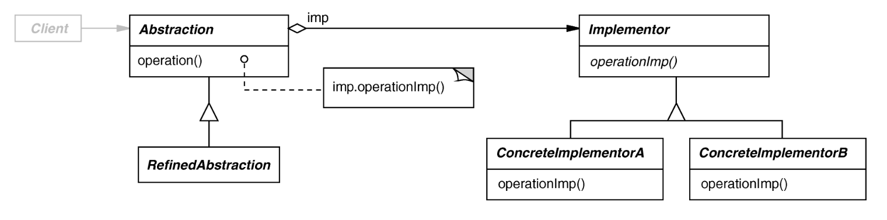

# Bridge Pattern 
Also known as Handle/Body

## Intent
Decouple an abstraction interface from its physical implementation(s) so that the two can vary independently

## Motivation
When an abstraction can have multiple implementations, a common approach is to use inheritance. An abstract class defines the interface to the abstraction and the concrete subclasses implement it in different ways. However, using inheritance is not always the best solution since it can be cumbersome to modify, extend, and reuse abstractions and implementations independently.

Bridge pattern addresses the problems of strict inheritance by putting the abstract interface and the implmentation in their own class hierarchies. The relationship between the abstraction and the implementation is known as the bridge.

## Applicability
Use the bridge pattern when:
- You want to avoid permanent binding between an abstraction and its implementation
    - e.g. when the implementation must be selected/switched at runtime
- Both the abstractions and their implementations should be extensible by subclassing
- Changes in the implementation should have no impact on the abstraction interface and client code that uses the interface
- You need a uniform interface to interchangeable class hierarchies

## Structure


## Participants
- Abstraction
    - defines the abstraction's interface
    - maintains a reference to an object of type Implementor
- RefinedAbstraction
    - Extends the interface defined by Abstraction
- Implementor
    - defines the interface for implementation classes
      - does not have to correspond exactly to Abstraction's interface (can be quite different)
    - Implementor interface provides only primitive operations and Abstraction defines higher-level operations based on these primitives
- ConcreteImplementor
    - implements the Implementor interface and defines its concrete implementation


## Collaborations
Abstraction forwards client requests to its Implementor object

## Consequences
- (+) Decoupled abstract interface and implementation
    - (+) Implementations can vary dynamically (i.e. at runtime)
    - (+) Eliminates compile-time dependencies on the implementation (e.g. changing implementation class doesn't require recompiling abstraction class and its clients)
- (+) Improved extensibility- can extend the Abstraction and Implementor hierarchies independently
- (+) Hiding implementation details from clients- you can shield clients from implmentation details
- (+) Can be used transparently with STL algorithms and containers

## Implementation
The following implementation issues should be considered when applying the bridge pattern:

- Creating an abstract implementor class is unnecessary when there is only one implementation
- If sharing implementors a form of reference counting needs to be implemented
- Determining the right implementor to create for the use case 
    - Decision can be made in constructor based on passed in params
    - Decision can also be made by outside object such as a factory


## Sample Code
``` c++
class Abstraction {
public:
    Abstraction();
    
    virtual void doSomething();
    ... 

protected:
    Implementor* getImp();

private:
    Implementor* _imp;
}
```

``` c++
class Implementor {
public:
    virtual void someFunc();
    ...
protected:
    Implementor();
}

```

## Related Patterns
- an abstract factory can create and configure a bridge
- the adapter pattern is geared toward making unrelated classes work together (usually applied to systems after they are designed)
    - bridge is used up-front in a design