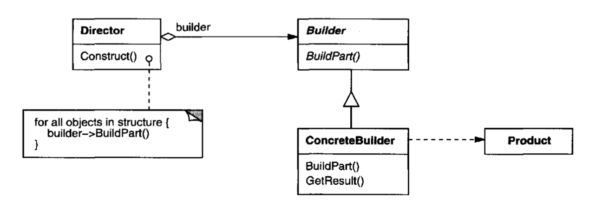
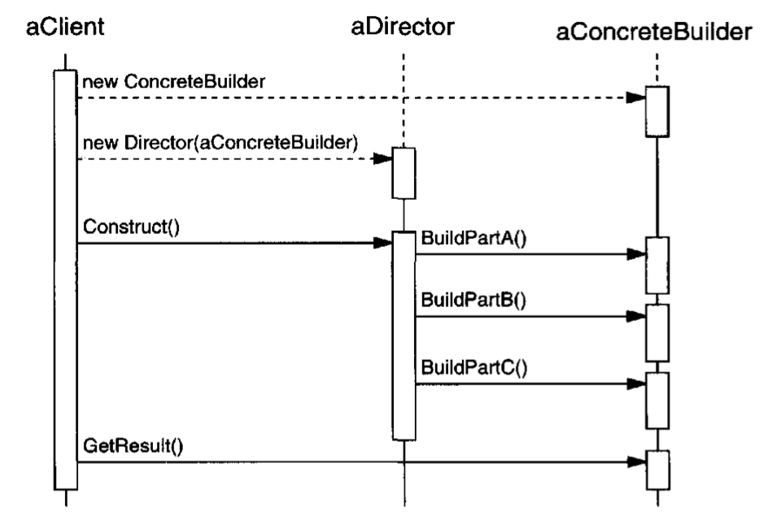

# Builder Pattern

## Intent
Separate the construction of a complex object from its representation so that the same construction process can create different representations

## Applicability
- When the algorthim for creating a complex object should be independent of the parts that make up the object 
- When the construction process must allow different representations for the object that's constructed
    - Ex: multiplication in an expression tree can also be represented as repeated addtion 

## Structure

## Participants
- *Builder*-specifies an abstract interface for creating parts of a product object
- *ConcreteBuilder*- constructs and assembles parts of the product by implementing the Builder interface
- *Director*- constructs an object using the Builder interface
- *Product*- represents the complex object under construction 

## Collaborations
- Client creates the Director object and configures it with the desired builder object
- Director notifies the builder whenever a part of the product should be built
- Builder handles requests from the director and adds parts to the product
  - Client retrieves the product from the builder

## Consequences
- (+) Can vary a product's internal representation (all you need to do is define a new builder)
- (+) Isolates code for construction and representation
- (+) Finer control over the construction process
- (-) May involve lots of classes

## Implementation
- Usually no abstract class for products since they each may differ so much in their representation 

## Related Patterns

- Abstract Factory also creates complex objects but the difference is that builder pattern focuses on creting the complex object step by step while the abstract factory's focus is on families of product objects 
- Builder often builds a Composite
