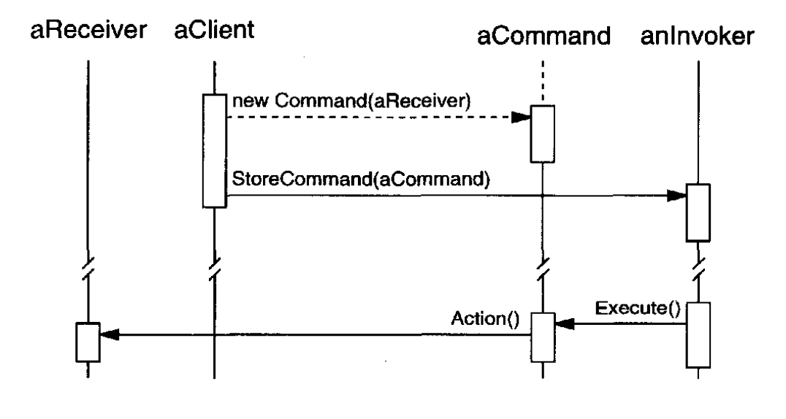

# Command Pattern 
Also known as Action or Transaction 

## Intent
Encapsulate a request for a service as an object

## Motivation
Part of an application that may issue a command (e.g. a button click) might not be able to execute the command itself (e.g. performing the action of the button click would be done by a different part of the application). The comand pattern allows commands to be created and passed around as objects so that a receiver/target with the proper scope can execute commands issued by any part of the application.

## Applicability
- To parameterize objects with an action to perform
- To specify, queue, and execute requests at different times
    - Command object can have a lifetime independent of the original request so if the receiver/target can be stored indepedently of the caller, then command object can be transfered to a different process and executed there are the proper time
- For multilevel undo/redo
    - The execute operation can store state for reversing its effects
- Can log changes to be reapplied in case of a system crash

## Structure


## Participants
- Command
    - declares an interface for executing an operation
- ConcreteCommand (ex: PasteCommand, OpenCommand)
    - defines a binding between a receiver object and an action
    - implements Execute by invoking the corresponding operations on Target 
- Client (ex: Application)
    - Creates a ConcreteCommand object and sets its target
- Invoker (ex: MenuItem)
  - asks the command to carry out the request
- Receiver/Target (ex: Document, Application)
  - knows how to perform the operations associated with carrying out a request (e.g. Document knows how to handle the paste command by adding the contents of the clipboard to the document)
  - Any class may serve as a target/receiver

The diagram below shows the interactions between the objects and how Command decouples the invoker from the receiver and the request it carries out


## Collaborations
- The client creates a ConcreteCommand object and specifies its receiver
- An Invoker object stores the ConcreteCommand object
- The invoker issues a request by calling `execute` on the command
- The ConcreteCommand object invokes operations on its receiver to carry out the request

## Consequences
- (+) Decouple the object that invokes the operation from the one that knows how to perform it
- (+) Commands are first-class objects that can be manipulated and extended like any other object
- (+) Can assemble commands into a composite command (e.g macros)
- (+) Can easily add new commands
- (+) Supports arbitrary-level undo/redo
- (-) May result in lots of trivial command subclasses --> doesn't scale well to hundreds or thousands of commands
- (-) Excessive memory may be needed to support long time horizons of undo/redo operations

## Implementation
- Supporting undo and redo requires a ConcreteCommand to store additional state
    - Possible state: The receiver, thearguments to the operation, and/or original values in the receiver that changed due to the command
    - Place each executed command onto a stack 
        - Each command has the required state to restore a previous version of the application (the state can be light or heavy depending on the application)
        - Popping from the stack restores other versions of the application
- Handling hysteresis
    - Want to watch out for the accumulation of error in the undo/redo process that causes the application's state to diverge from its original value
- The pattern can be used to support transactions

## Sample Code

``` c++
class Command {
public:
    virtual ~Command();
    virtual void execute() = 0;
protected:
    Command();
}
```

``` c++
class ConcreteCommand : public Command {
public:
    ConcreteCommand(Client*);
    virtual void execute();

private:
    Target* _target;
}

ConcreteCommand::ConcreteCommand(Target* target) : _target(target)  {}

ConcreteCommand::execute() {
    _target->doSomething();
}
```

## Related Patterns
- Composite pattern can be used to implement MacroCommands
- A Memento can keep state the command requires to undo its effect
- A command that must be copied before being placed on the history list acts as a prototype