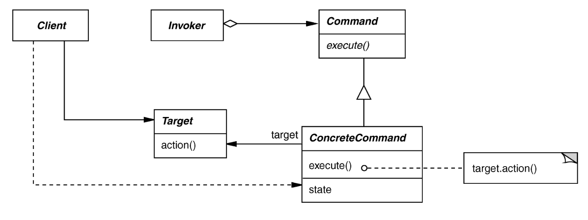

# Command Pattern 

## Intent
Encapsulate the request for a service

## Applicability
- To parameterize objects with an action to perform
- To specify, queue, and execute requests at different times
- For multilevel undo/redo

## Structure

## Consequences
- (+) Abstracts executor of a service
- (+) Supports arbitrary-level undo/redo
- (+) Composition yields macro-commands
- (-) May result in lots of trivial command subclasses --> doesn't scale well to hundreds or thousands of commands
- (-) Excessive memory may be needed to support long time horizons of undo/redo operations

## Implementation
- Handling hysteresis
- Supporting transactions
- Place each executed command onto a stack 
    - Each command has the required state to restore a previous version of the application (the state can be light or heavy depending on the application)
    - Popping from the stack restores other versions of the application