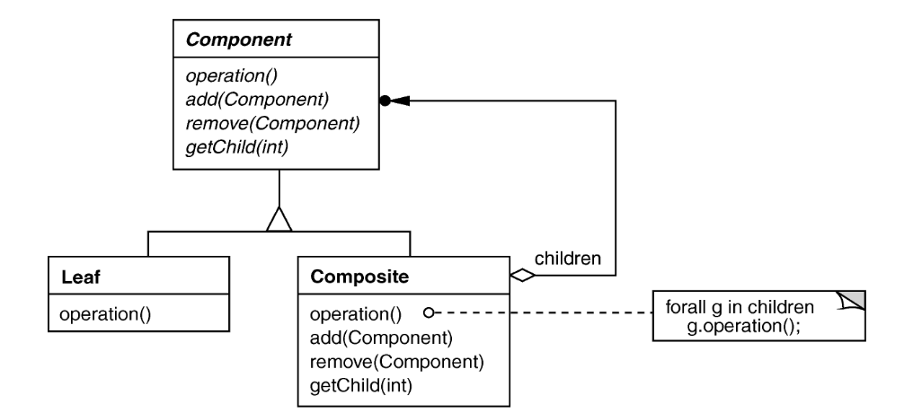

# Composite Pattern 

## Intent
Treat individual objects and multiple, recursively-composed objects uniformly

## Applicability
- Tree structure
- Objects must be composed recursively
- No distinction between individual and composed elements (root node is itself a tree)
- Objects in strcutre can be treated uniformly

## Structure

## Participants
participatnig classes/objects and their responsibilities

## Collaborations
How participants cooperate to carry out their responsibilities

## Consequences
- (-) Overhead: might be prohibitive as the number of objects increases (e.g. impractical for linux kernel with 30+ million lines of code)
- (-) Awkward designs: may need to treat leaves as lobotomized composites

## Implementation
- Do components need to know their parents?
    - If so, add a parent pointer to components
- Does there need to be a uniform interface for both leaves and composites?
- Need to decide who has the responsibility for deleting children
- Do we allocate storage for children in component base class
    - In the expression tree, someone outside the tree will do this actual creation of children nodes (i.e. the interpreter)