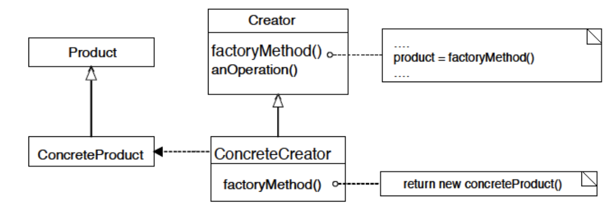
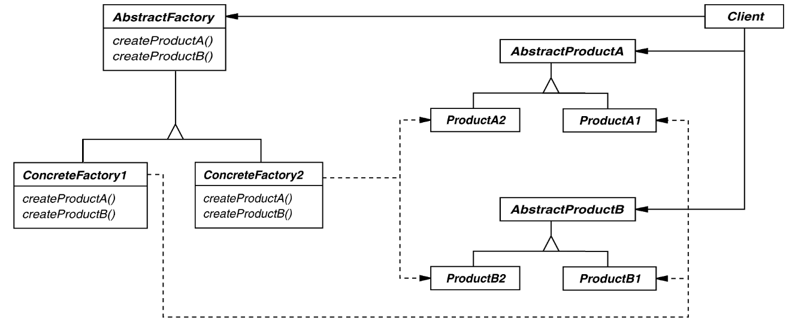

# Factory Pattern 
## Intent
Provide an interface for creating an object, but leave the choice of the object's concrete type to a subclass

## Applicability
- When a class cannot anticipate the objects it must create 
- When a class wants its subclasses to specify the objects it creates
- When a standard interface for creating objects is useful in enforcing rules on how objects are created

## Structure

## Consequences
- (+) Client code becomes more flexible since we avoid specifying the class name of the concerete class 
    - Resilient to adding more objects or changing how objects are made
- (+) Client is only dependent on the interface
    - Remove burden of knowing how to create things from the user and give user a simple interface for making new objects
- (-) Construction of objects requires one additional class in some cases

## Implementation
- 2 choices:
    - 1) Creator class is abstract and doesn't implement creation methods meaning it must be subclassed
    - 2) Creator class is concrete and provides a default implementation meaning it can optionally be subclassed
- Should be parameterized if a factory method needs to be able to create different variants

## Known Uses
- All STL containers are factories
- Database connectors (a standard way of creating a database connection that only has to be changed in one place instead of across the application)

# Abstract Factory Pattern

## Intent
Create families of related objects without specifying subclass names

## Applicability
When clients cannot anticipate groups of classes to instantiate

## Structure

## Consequences
- (+) Flexibility: remove type/subclass dependencies from clients
- (+) Abstraction and semantic checking: hides product's composition
- (-) Hard to extend interfacce to create new products
 
## Implementation
- Parameterization as a way of controlling the interface's size
- Configuration with Prototypes (i.e. determines who creates the factories)
- Essentially groups of factory methods