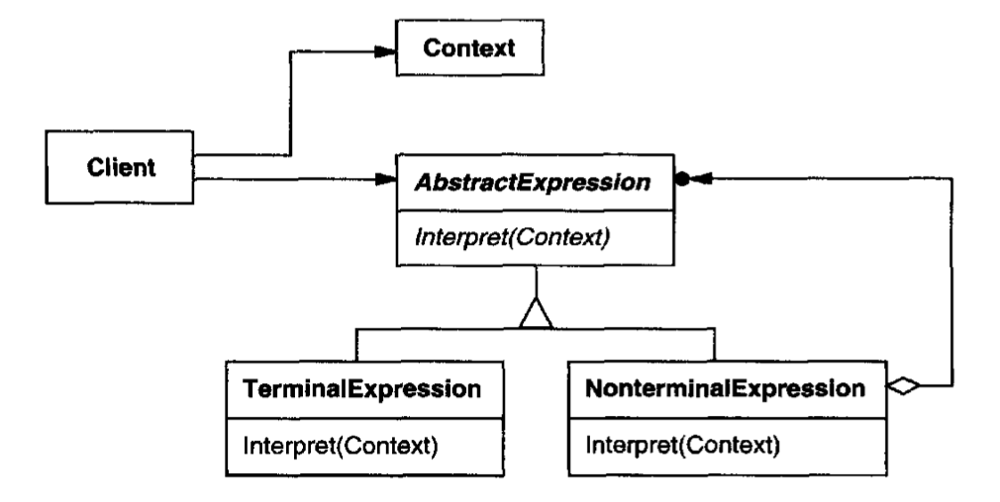

# Interpreter Pattern

## Intent
Given a language, define a representation for its grammar along with an interpreter that uses the representation to interpret sentences in the languages 

## Applicability
- When there is a language to interpret and statements in the language can be represented as abstract syntax trees

- Works best when:

  - The grammar is simple and relatively stable (e.g. don't use for a programming language like C++)
  - Expression can be interpreted without building abstract syntax trees (saves space and time)
  - Efficiency is not a critical concern (other techniques for efficient interpreters)

  

## Structure

## Participants
- *AbstractExpression*- declares an abstract Interpret operation that is common to all nodes in the abstract syntax tree
- *TerminalExpression*- implements an Interpret operation associated with terminal symbols in the grammar
- *NonTerminalExpression*- one such class is required for every rule in the grammar 
  - Maintains references to other AbstractExpressions to represent the remaining subexpressions to be interpreted
  - Interpret operation typically calls itself recursively on the variables representing each of the rules 
- *Context*- contains information that is global to the interpreter
- *Client*- calls the Interpret operation in order to build an abstract syntax tree representing a particular sentence in the language defined by the grammar

## Collaborations

- The client builds the sentence as an abstract syntax tree of Terminal and Nonterminal expression instances. The client then initializes the content and invokes the Interpret operation
- NonTerminal expressions define Interpret in term of Interpret on each subexpression
- Interpret operations use the context to store and access the state of the interpreter

## Consequences
- (+) Simple grammars are easy to change and extend
    - All rules are represented by distinct classes in an orderly manner
- (+) Adding another rule adds another class
- (-) Complex grammars are hard to maintain 
    - More interdependent rules yield more interdependent classes
    - Parser or compiler generators are more appropriate for complex grammars

## Implementation
- Doesn't explain how to create an abstract syntax tree (doesn't address parsing)
- Express the language rules, one per class
- Alternations, repetitions, or sequences expressed as nonterminal expressions
- Literal translations expressed as terminal expressions
- Create interpret method to lead the context through the interpretation classes

## Sample Code

## Known Uses

- Regular expression (regex) is a language for searching for patterns in strings so that custom algorithms are not needed for each proble (the problem is so often occuring that it made sense to develop a simple grammar and interpeter that can parse sentences of the language)

## Related Patterns

- The abstract syntax tree is an instance of the composite pattern
- An iterator can be used to traverse the structure
- The visitor pattern can be used to maintain the behavior in each node in the syntax tree in one class