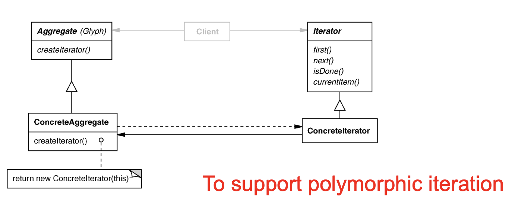

# Iterator Pattern 

## Intent
Access elements of a container without exposing its representation

## Applicability
- Require multiple traversal algorithms over a container
- Require a uniform traversal interface over different containers
- When container classes and traversal algorithm must vary independently 

## Structure

## Consequences
- (+) Flexibility: container and traversal are independent
- (+) Multiple iterators and multiple traversal algorithms
- (-) Additional communication overhead between iterator and container
    - Problematic for iterators in concurrent or distributed systems

## Implementation
- Internval versus external iterators
- Violating the object strucutre's encapsulation
- Robust iterators
- Synchronization overhead in multi-threaded programs
- Batching in distributed and concurrent programs