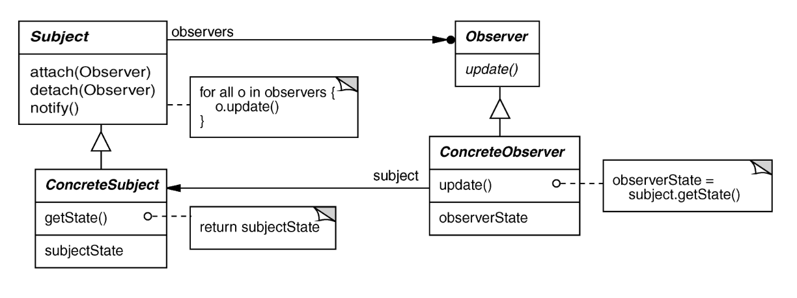

# Observer Pattern
Also known as the pub/sub

## Intent
Define a one-to-many dependency between objects so that when one object changes state, all dependents are notified and updated 

## Applicability
- When an abstraction has two aspects, one dependent on the other
- When a change to one object requires changing untold others
- When an object should notify unknown other objects

## Structure



- Subject base class implements all interactions with observers
    - This means it does not necessarily have to be an abstract base class
- Concrete subject class only needs to call notify to send updates to all the observers
- Can have multiple different concrete observers that use the subject's data in different ways

## Participants

- *Subject*- object being watched for state changes. Knows its observers and provides an interface for attaching and detaching observer objects
- *Observer*- defines an updating interface for objects that should be notified of changes in a subject
- *Concrete Subject*- stores the state of interest to ConcreteObserver objects
  - Sends a notification to its observers when its state changes
- *Concrete Observer*-  maintains a reference to a concrete subject
  - Implements the Observer's updating interface to keep its state consistent with the subject's 

## Collaborations
The observers do not communicate with each other. A higher level of abstraction is thus required to keep track of things such as repeat observers.

## Consequences
- (+) Modularity- subject and observers can vary independently 
    - Subject only knows it has a list of Observers, doesn't know their concrete types (loosely coupled)

- (+) Extensibility- can define and add any number of different observers
- (+) Customizability- different observers offer different views of the subject 
- (-) Unexpected updates- Observers don't know about each other
- (-) High update overhead (especially in large networks of observers)
    - Can be reduced using hints or filtering

## Implementation
- Can filter the data an observer receives to decrease the update overhead 
    - Observers can register what data from the subject they are interested so not all the data needs to be sent to each observer
- An observer can be a subject that updates its own observers  
    - Can create large networks with high update overhead
    - Can also create accidental update cycles (common in enterprise software)
- Need to handle dangling references left by observers that suddenly crash or get deleted
- Push vs. Pull models
    - Pull model- subject sends message saying its data changed and observers can optionally request the updated data 
        - Allows observers to pull the data at varying rates
    - Can implement both with pull model for certain observers and push for other observers 

## Sample Code
Below we define a simple abstract base class that has a method to be called when an event happens to the object being observed

``` c++
template <typename T> class Observer {
public:
  virtual void handleEvent(const T &) = 0;
};
```

Below we define a simple base class for any objects that we want to be subjects (observable)
``` c++
template <typename T> class Subject {
public:
  /**
   * Default constructor
   */
  Subject() = default;

  /**
   * Add an observer to this subject
   * @param ref New observer to notify of changes
   */
  void add(Observer<T> &ref) { observers.insert(&ref); }

  /**
   * Remove an observer
   * @param ref Observer to stop notifying of changes
   */
  void remove(Observer<T> &ref) { observers.erase(&ref); }

protected:
  /**
   * Notify all observers of change
   * @param obj Object that has changed
   */
  void Notify(T &obj) {
    for (auto observer : observers)
      observer->handleEvent(obj);
  }

private:
  /**
   * Set of recorded observers
   */
  std::set<Observer<T> *> observers;
};
```

[Here](https://github.com/vu-cs3251-21f/lec16a) is the github repo with the example code from lecture.

## Known Uses
- MVC
- Smart phone event frameworks
- Pub/sub middleware (ROS, DDS, JAva Message Service, etc.)
- Mailing lists
