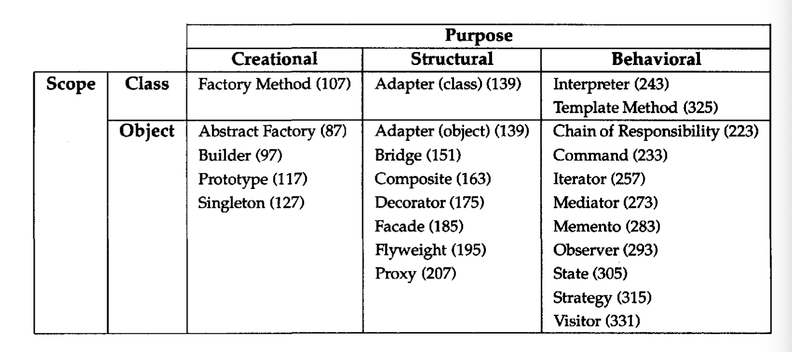
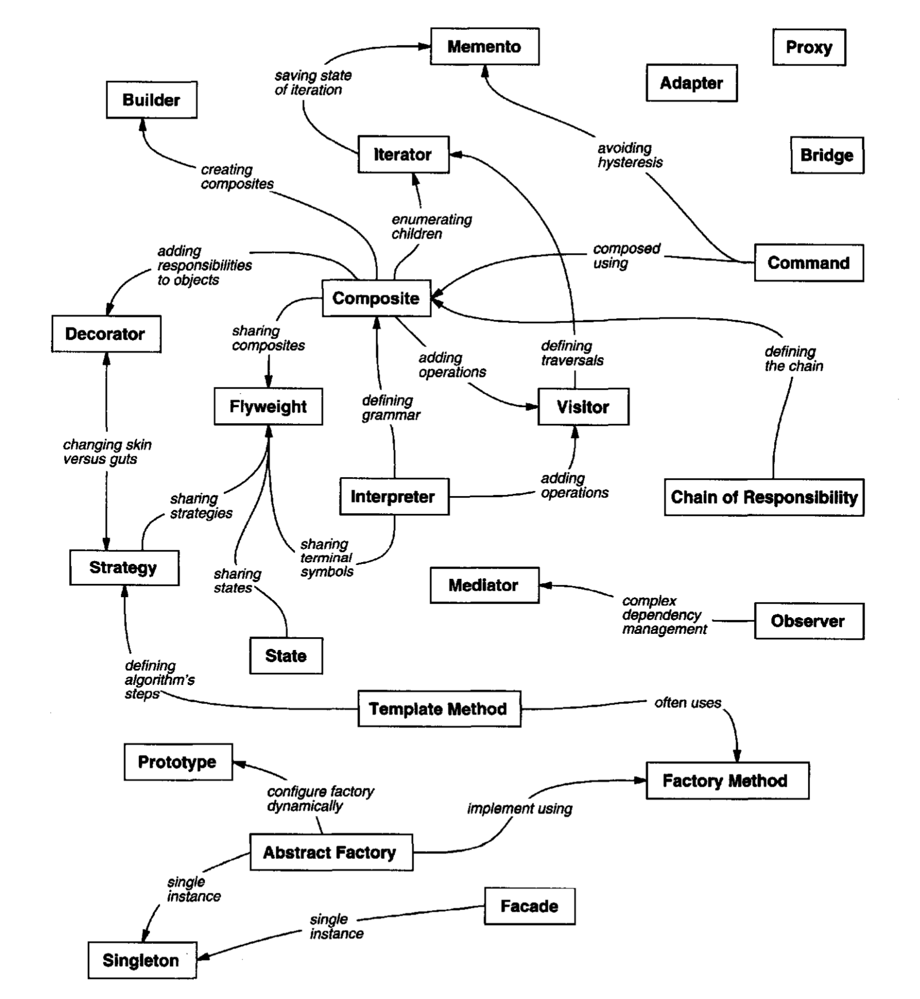
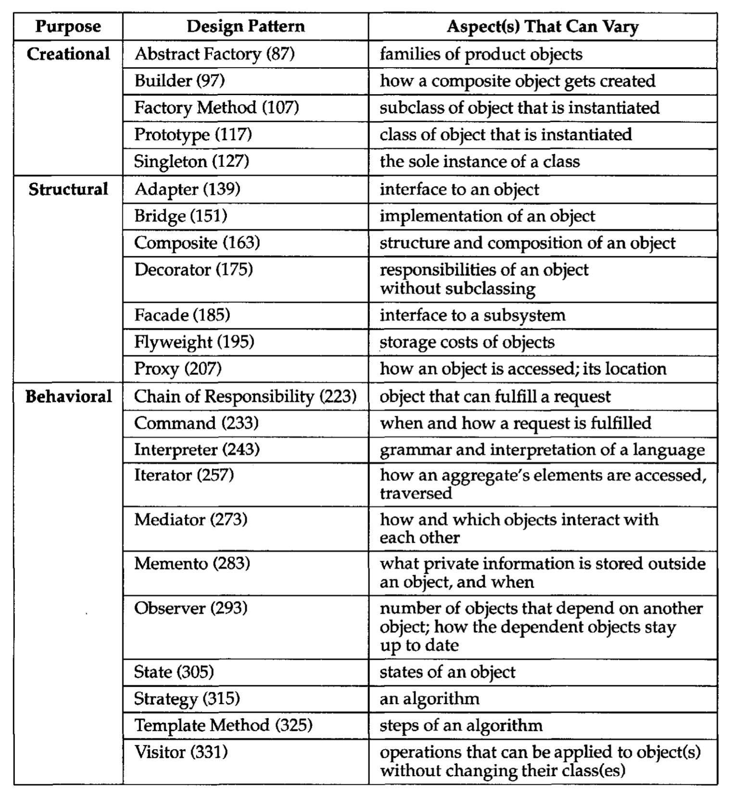

# Design Patterns
Design patterns are simply object oriented software designs that often recurr as the solution to certain problems when designing large and complex software. The commonality in these recurring designs is distilled into patterns that codify these good practices for solving common problems. 

Each design pattern systematically names, explains, and evaluates an important and recurring design in object-oriented systems.

Design patterns help us decide what should be an object and what its responsibilities should be.

## Goals 
- Codify good object oriented design and implementation practices
    - Distill and generalize experience to aid novices and experts alike
- Design structures with explicit names create a common vocab & reduce complexity
- Capture/preserve design and implementation knowledge
    - Articulate key decisions succintctly
    - Improve documentation
- Facilitate restructuring/refactoring
  
## Types 

- **Purpose**- what a pattern does
    - **Creational**- concern the process of object creation
    - **Structural**- deal with the composition of classes/objects
    - **Behavioral**- characterize the ways in which classes/objects interact and distribute responsibility
- **Scope**- specifies whether the pattern applies primarily to classes or objects
    - **Class patterns**- focus on relationships between classes and their subclasses which are defined through inheritance so they are fixed at compile time
    - **Object patterns**- deal with object relationships which can be changed at runtime and are more dynamic

Creational class patterns defer some part of object creation to subclasses, while Creational object patterns defer it to another object. The Structural class patterns use inheritance to compose classes, while the Structural object patterns describe ways to assemble objects. The Behavioral class patterns use inheritance to describe algorithms and flow of control, whereas the Behavioral object patterns describe how a group of objects cooperate to perform a task that no single object can carry out alone.

## Organization
Patterns often reference each other so a graph can be another useful way of organizing the different patterns:

Design aspects that design patterns let you vary:

## OMT Object Model Notation
- Used in the diagrams
- Precursor to UML
- dashed arrowhead line: class instantiates an object of the class being pointed to
- triangle: inheritance
    - abstract class- italicized names
    - filled triangle indicates a virtual base class
- plain arrowhead line: class keeps a reference to the class being pointed at
- diamond on one end, arrow on the other: aggregation of the class being pointed at
- filled black circle- multiplicity
- empty circle- optional multiplicity