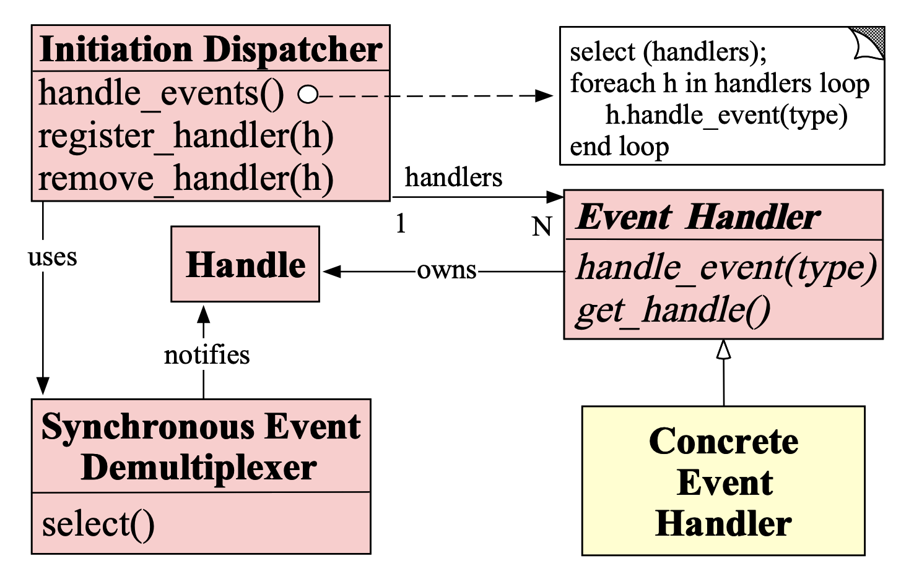

# Reactor Pattern 
any aliases this pattern is known by

## Intent
Allows event-driving applications to demultiplex and dispatch service requests that are delivered to an application from one or more clients.

## Applicability
- When you need to decouple event handling from event detecting/demuxing/dispatching
- When multiple sources of events must be handled in a single thread

## Structure

## Consequences
- (+) Separation of concerns and portability 
- (+) Simplify concurrency control
- (-) Non-preemptive

## Implementation
- Decouple event demultiplexing mechanisms from event dispatching?
- Handle many idfferent types of events (e.g. input/output events, signals, timers, etc.)