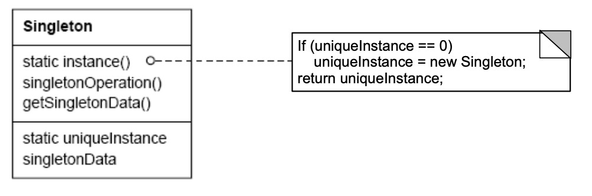

# Singleton Pattern 

## Intent
Ensure a class only ever has one instance and provide a global point of access

## Applicability
- When there must be exactly one instance of a class and it must be accessible from a well-known access point
- When the sole instance should be extensible by subclassing, and clients should be able to use an extended instance without modifying their code

## Structure



## Consequences
- (+) Reduces namespace pollution
- (+) easy to change and allow multiple instances
- (+) allow extension by subclassing
- (-) Same drawbacks of a global if misused 
- (-) Implementation may be less efficient than a global variable
- (-) Concurrency pitfalls and communication overhead

## Implementation
- Static instance operation
- Registering the singleton instance
    - runtime though instead of compiletime
- Deleting singletons
  - Not automatically destroyed by anything
  - Usually use a shared pointer instead of raw pointer to deal with this
  - Lifecycle is not as well defined as simple variables

## Sample Code

``` c++
class Singleton {

public:
    static Singleton& getInstance()
    {
        if (inst == nullptr) inst = new Singleton();
    
        return *inst;
    }

    Singleton(Singleton const&) = delete;
    void operator=(Singleton const&) = delete;

private:
    static Singleton* inst;
    Singleton() {}
};

// must provide initial value for static variable outside of class
Singleton* Singleton::inst = nullptr;
```

Then a singleton would be created like:

``` c++
int main() {
    Singleton& one = Singleton::getInstance();
    Singleton& two = Singleton::getInstance();
  return 0;
}
```
## Known Uses
- Hardware interface access
- Logger: so everything is logged to same place in correct order using access protections