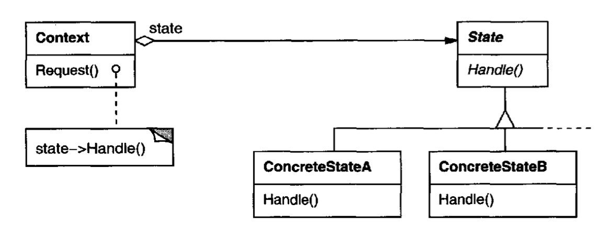

# State Pattern 

## Intent
Allow an object to alter its behavior when its internal state changes. The object will appear to change its class.

## Applicability
- When an object's behavior depends on its state, and it must change its behavior at runtime depending on that state
- When several operatio onal 
structure that depends on the object's state
- When its beneficial to treat the object's state as an object that can vary independently of everything else 

## Structure

## Participants
- Context (ex: TCPConnection)
    - defines the interface of interest to clients
    - maintains an instance of a ConcreteState subclass that defines the current state
- State (ex: TCPState)
    - defines an interface the behavior associated with a particular state of the Context
- ConcreteState subclasses (ex: TCPEstablished, TCPListen, TCPClosed)
    - each subclass implments a behavior associated with a state of the context

## Collaborations
- Context delegates state-specific request to the curent ConcreteState object
- A context may pass itsself as an argument to the State object handling the request so that the State object can access the context if necessary
- Context is the primary interface for clients so they don't have to deal with State objects directly
- Either Context or the ConcreteState subclasses can decide which state succeeds another and under what circumstances

## Consequences
- (+) Localizes state-specific behavior and partitions behavior for different states
- (+) Makes state transitions explicit (also protects context from incosistent states)
- (+) State objects can be shared if they have no instance variables
- (-) Can result in many subclasses that are hard to understand 

## Implementation
- Who defines the state transitions? Context or the ConcreteState subclasses
- Consider using table-based alternatives
- Creating and destroying state objects: do you create and destroy them as needed or create them ahead of time and never destroy
    - 1st option preferable when contexts change state frequently and it is unknown what states will be entered
    - 2nd option preferable when state changes occur rapidly and want to avoid overhead of repeated creation/deletion

## Related Patterns
- The flyweight patterns explains when and how State objects can be shared
- State objects are often singletons

## Finite State Machine
- A state is a distinguishable, disjoint (one state at a time), condition that persists for a significant period of time (FSMs spend all their time in states)
- A transition is the changing from one state to another
    - represent responses to events (from external or internal sources)
- A finite state machine is a model of computation with state behavior defined by a set of states and set of transitions
- Useful for mathematically proving safety in critical systems
    - Ex: add states that are unsafe and prove they can't be reached