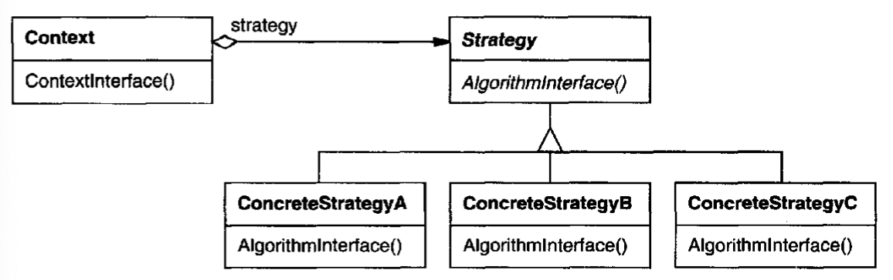

# Strategy Pattern 
Also known as Policy pattern

## Intent

Define a family of algorithms, encapsulate each one, and make them interchangeable. Lets the algorithm vary independenty from the clients that use it

## Applicability
- When many related classes differ only in their behavior
  - Strategy pattern lets us configure a class with one of many behaviors
- When you need different variants of an algorithm 
- When an algorithm uses data structures that should not be exposed to clients

## Structure

## Participants
- *Strategy*- declares an interface common to all supported algorithms
  - Context uses this interface to call the algorithm defined by a ConcreteStrategy
- *ConcreteStrategy*- implements a variant of the algortihm using the Strategy interface
- *Context*- configured with a ConcreteStrategy object and matinains a reference to a Strategy object 
  - Might define an interface that lets Strategy access its data

## Collaborations
- Strategy and Content interact to implement the chosen algorithm 
  - Context may pass all data required by the algorithm to the strategy when the algorithm is called
  - Alternatively, context can pass itself as an argument to the strategy allowing the strategy to call it as required 
- Context forwards requests from its clients to its strategy 
  - Clients usually create and pass a ConcreteStrategy object to the context and then only interact with the context from there on out 

## Consequences
- (+) Families of related algorithms
- An altertive 
- (+) Eliminate conditional statements for selecting the desired behavior 
  - Encapsulating different behaviors in seperate strategy classes eliminates conditional statements 
- (+) Can provide different implementations (size/speed tradeoffs) of the same behavior 
- (-) Clients must be aware of different strategies
- (-) Communication overhead between strategy and context 

## Implementation
- How will the strategy have access to data it needs in the context?
- Can use templates to configure a class with a strategy if it can be selected at compile-time and doesn't need to be changed at runtime