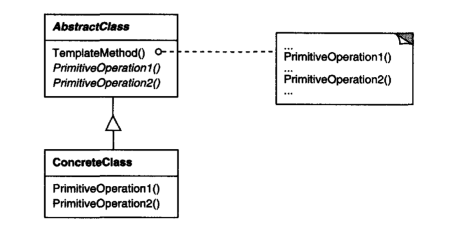

# Template Pattern 
## Intent
Define a skeleton of an algorithm in an operation, deferring some steps to subclasses. Subclasses redefine certain steps of an algorithm without changing the algorithm's structure.

## Applicability
- Used to implement the invariant parts of an algorithm once and then leave it to the subclasses to implement the behavior that can vary
- When common behavior among subclasses should be factored and localizied in a common class to avoid code duplication 

## Structure

## Participants
- *AbstractClass*- defines abstract primitive operations that concrete subclasses define to implement steps of an algorithm
  - Implements a template method defining the skelton of an algorithm by calling primitive operations as well as other necessary methods
- *ConcreteClass*- implements the primitive operations to carry out subclass-specific steps of the algorithm

## Collaborations
- ConcreteClass relies on AbstractClass to implement the invariant steps of the algorithm 

## Consequences
- (+) Inverted control principle- parent calls the operations of a subclass (not the other way)

## Implementation
- Goal is to minimize the number of primitive operations a subclass must override to flesh out the algorithm

## Related Patterns

- Factory Methods are often called by template methods
- Template methods use inheritance to vary part of an algorithm while strategies use delegation to vary the entire algorithm 