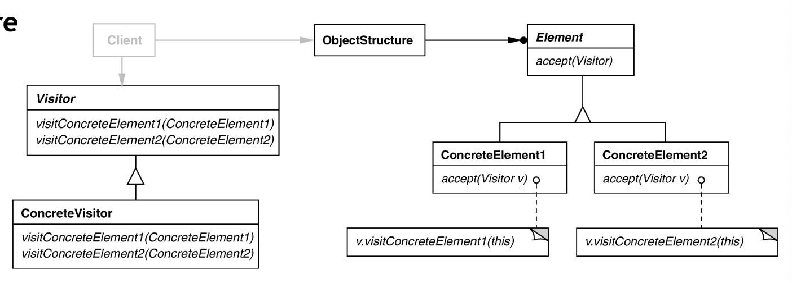

# Visitor Pattern 
## Intent
Centralize operations on an object structure so that they can vary independently but still behave polymorphically. Lets you define a new operation without changing the classes of the elements on which it operates.

## Applicability
- when classes define many unrelated operations
- when relationships of objects in the structure rarely change, but the operations on them change often
- algorithms keep state that is updated during traversal

## Structure

## Participants

- *Visitor*- declares a Visit operation for each class of the ConcreteElement in the object structure
- *ConcreteVisitor*- implements each operation declared by Visitor and stores local state of the algorithm that is acculumated during the traversal of the object 
- *Element*- defines an accept operation that takes a visitor as an argument (e.g. Node)
- *ConcreteElement*- implements an accept operation that takes a visitor as an argument (e.g. AddNode, SubtractNode, .. )
- ObjectStructure- can enumerate its elements 

## Collaborations

- Client that uses a visitor pattern must create a ConcreteVisitor object and then traverse the object structure, visiting each element with the visitor
- When an element is visited, it calls the visitor operation that corresponds to its class by supplying itself as an argument. to the operation

## Consequences

- (+) Flexibility: visitor algorithm(s) and object structure are independent
  - Easy to add new operations

- (+) Localized functionality in the visitor subclass instance (related behaviors are grouped together in a visitor and unrelated behaviors have a seperate visitor)
- (-) Circular dependency between Visitor and Element interfaces
- (-) Visitor brittle to new ConcreteElement classes

## Implementation
- Double dispatch- operations that is executed depends on the kind of request and the types of *two* receivers (the Visitor's and the Element's)
  - visitor pattern lets you add operations to classes without changing them by using this
- General interface to elements of object structure
- Who is responsbile for traversing the object structure? 

## Related Patterns 

- Visitors can be used to apply an operation over an object structure defined by a composite
- Visitor can be applied to do the interpretation in the Interpreter pattern